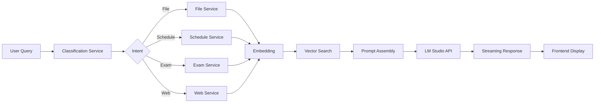

# Product Requirements Document (PRD)

## 1. Purpose & Scope

Define the functionality and objectives of the **Study Assistant for PTIT**, focusing on AI-powered chat, schedule lookup, document QA, and web search.

## 2. Objectives & Success Metrics

- **Speed:** Reduce schedule lookup time by 80%.
- **Accuracy:** Achieve ≥90% intent classification accuracy.
- **Reliability:** Support ≥95% uptime for core services.
- **User Satisfaction:** ≥4.5/5 rating in feedback surveys.

## 3. User Stories

1. **Schedule Lookup**: _As a student_, I want to ask "What's my schedule tomorrow?" to view my classes.
2. **Exam Timetable**: _As a student_, I want to ask "When is my next exam?" to see exam dates.
3. **Document QA**: _As a student_, I want to upload a PDF and ask questions about its content.
4. **Model Selection**: _As a student_, I want to choose between local AI models (Qwen, Gemma).
5. **Web Search**: _As a student_, I want to toggle web search for up-to-date information.
6. **Session History**: _As a student_, I want to view past conversations for reference.

## 4. Functional Requirements

### 4.1 Chat Interface

- Text input with model selector (Qwen, Gemma, etc.).
- Streaming responses via SSE or OpenAI-compatible stream.
- Markdown rendering with code support.

### 4.2 Schedule & Exam Lookup

- Endpoint: `GET /ptit/schedule?date=YYYY-MM-DD`.
- Endpoint: `GET /ptit/exams?week=this|next|last`.
- Display time, subject, location in a table.

### 4.3 File Upload & QA

- Endpoint: `POST /file/upload` (multipart/form-data).
- Process PDF/DOCX: extract text, chunk, embed.
- Store embeddings and metadata in Supabase.
- Endpoint: `POST /chat` with `contextIds` to include file context.

### 4.4 Web Search Integration

- Toggle Brave Search API in settings.
- Scrape top results, chunk, embed web content.
- Include source URLs in responses.

### 4.5 Model Management

- Configurable agents in `app/config/agents.py`.
- Use LM Studio HTTP API for all chat and classification.

## 5. Non-functional Requirements

- **Performance:** Classification <200ms, chat <3s.
- **Security:** JWT auth, secure file storage, no plaintext passwords.
- **Scalability:** Handle 1,000 concurrent users.
- **Maintainability:** Modular code, clear service boundaries.
- **Accessibility:** WCAG 2.1 AA compliance in UI.

## 6. Workflow & Architecture Overview

1. **Request**: Frontend sends user query to `/chat`.
2. **Classification**: LM Studio classifies intent.
3. **Context Gathering**: Invoke schedule, exam, file, or web services based on intent.
4. **Embedding**: Generate vectors for question and context.
5. **Vector Search**: Supabase RPC returns top-k chunks.
6. **Prompt Assembly**: Build system + user messages.
7. **Model Call**: LM Studio `/v1/chat/completions` with `stream=True`.
8. **Response**: Stream tokens to client, log session & messages.



## 7. Appendix: Code Samples

### 7.1 Vector Embedding

```python
from sentence_transformers import SentenceTransformer

model = SentenceTransformer('all-MiniLM-L6-v2')
query_vec = model.encode([user_query], batch_size=4)
```

### 7.2 LM Studio Chat Call with Streaming

```python
import openai

openai.api_base = "http://localhost:1234/v1"
openai.api_key = ""

response = openai.ChatCompletion.create(
    model="qwen3-8b",
    messages=[
        {"role": "system", "content": SYSTEM_PROMPT},
        {"role": "user", "content": user_query}
    ],
    stream=True
)

for chunk in response:
    print(chunk.choices[0].delta.get("content", ""), end="")
```

### 7.3 Prompt Template

```python
SYSTEM_PROMPT = (
    "You are a helpful PTIT study assistant.\n"
    "Use the following context to answer:\n{context}\n"
    "Provide concise, accurate responses."
)
```
