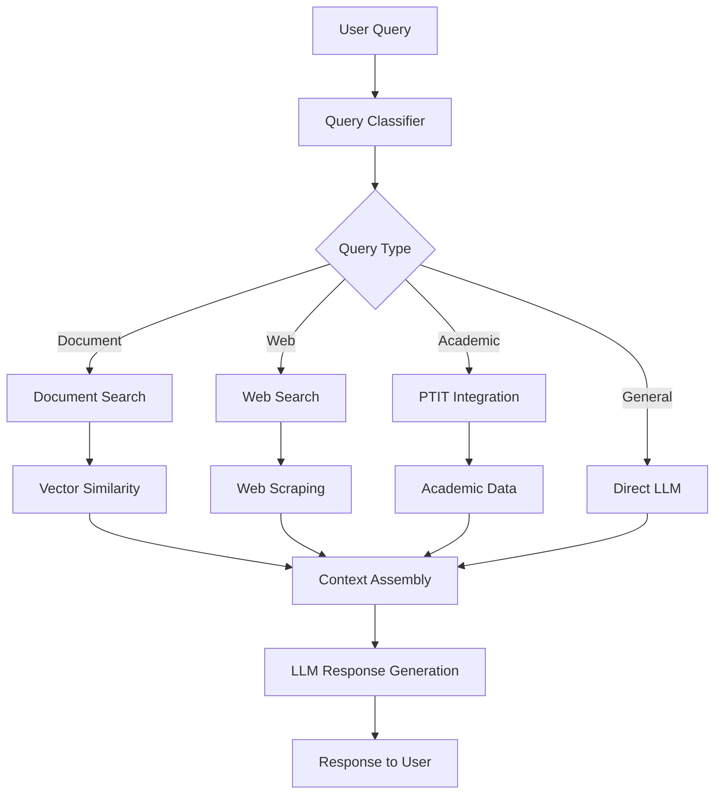

# AI Integration Report

## Table of Contents

1. [AI Architecture Overview](#1-ai-architecture-overview)
2. [Local LLM Integration](#2-local-llm-integration)
3. [Embedding Systems](#3-embedding-systems)
4. [Vector Search Implementation](#4-vector-search-implementation)
5. [Query Classification](#5-query-classification)
6. [Context Management](#6-context-management)
7. [Performance Analysis](#7-performance-analysis)
8. [Model Comparison](#8-model-comparison)

## 1. AI Architecture Overview

The Study Assistant implements a hybrid AI architecture combining local large language models (LLMs) with specialized embedding systems for intelligent document processing and conversational assistance.

### 1.1 System Components



### 1.2 AI Pipeline Flow

1. **Query Reception**: User message received via chat interface
2. **Classification**: Determine query type and required resources
3. **Context Retrieval**: Gather relevant information from multiple sources
4. **Prompt Engineering**: Construct optimized prompt with context
5. **Model Inference**: Generate response using local LLM
6. **Post-processing**: Format and deliver response to user

### 1.3 Key Technologies

**Language Models:**

- **Primary**: Qwen2.5-7B-Instruct (local deployment)
- **Fallback**: GPT-3.5-turbo (cloud API)
- **Embedding**: paraphrase-multilingual-MiniLM-L12-v2

**Infrastructure:**

- **Model Serving**: LM Studio / Ollama
- **Vector Database**: PostgreSQL with pgvector
- **Caching**: In-memory and Redis-based caching

## 2. Local LLM Integration

### 2.1 Model Selection Criteria

**Qwen2.5-7B-Instruct Selection Rationale:**

- **Multilingual Support**: Excellent Vietnamese and English performance
- **Model Size**: 7B parameters optimal for local deployment
- **Instruction Following**: Strong adherence to prompts and context
- **Hardware Requirements**: Runs efficiently on M2 MacBook Pro (16GB RAM)
- **License**: Commercial-friendly Apache 2.0 license

**Performance Characteristics:**

- **Inference Speed**: ~15-20 tokens/second on M2 chip
- **Context Window**: 32,768 tokens (sufficient for most use cases)
- **Memory Usage**: ~8GB VRAM for optimal performance
- **Response Quality**: Comparable to GPT-3.5 for educational tasks

### 2.2 LM Studio Configuration

**Optimal Settings:**

```json
{
  "model": "Qwen/Qwen2.5-7B-Instruct-GGUF",
  "context_length": 4096,
  "temperature": 0.7,
  "top_p": 0.9,
  "top_k": 40,
  "repeat_penalty": 1.1,
  "threads": 4,
  "gpu_layers": -1
}
```

**API Integration:**

```python
class LMStudioClient:
    def __init__(self, base_url="http://localhost:1234"):
        self.base_url = base_url
        self.session = requests.Session()
        self.session.headers.update({'Content-Type': 'application/json'})

    async def generate_response(self, messages, max_tokens=512):
        payload = {
            "model": "Qwen2.5-7B-Instruct",
            "messages": messages,
            "max_tokens": max_tokens,
            "temperature": 0.7,
            "stream": False
        }

        try:
            response = await self.session.post(
                f"{self.base_url}/v1/chat/completions",
                json=payload,
                timeout=30
            )
            return response.json()['choices'][0]['message']['content']
        except Exception as e:
            logger.error(f"LM Studio API error: {e}")
            raise AIServiceException("Local model unavailable")
```

### 2.3 Fallback Strategy

**Cloud API Integration:**

```python
class AIService:
    def __init__(self):
        self.local_client = LMStudioClient()
        self.openai_client = OpenAI(api_key=os.getenv('OPENAI_API_KEY'))

    async def generate_response(self, prompt, context):
        try:
            # Try local model first
            return await self.local_client.generate_response(prompt)
        except AIServiceException:
            logger.warning("Local model failed, using fallback")
            # Fallback to OpenAI
            return await self.openai_client.chat.completions.create(
                model="gpt-3.5-turbo",
                messages=prompt,
                max_tokens=512
            )
```

## 3. Embedding Systems

### 3.1 Embedding Model Architecture

**SentenceTransformers Implementation:**

```python
from sentence_transformers import SentenceTransformer

class EmbeddingService:
    def __init__(self):
        self.model = SentenceTransformer(
            'paraphrase-multilingual-MiniLM-L12-v2'
        )
        self.dimension = 384

    def encode_text(self, text: str) -> np.ndarray:
        """Generate embedding for text input"""
        # Preprocess text
        clean_text = self.preprocess_text(text)

        # Generate embedding
        embedding = self.model.encode(
            clean_text,
            normalize_embeddings=True,
            convert_to_numpy=True
        )

        return embedding

    def encode_batch(self, texts: List[str]) -> np.ndarray:
        """Batch encoding for efficiency"""
        clean_texts = [self.preprocess_text(text) for text in texts]
        embeddings = self.model.encode(
            clean_texts,
            batch_size=32,
            normalize_embeddings=True,
            convert_to_numpy=True,
            show_progress_bar=True
        )
        return embeddings
```

### 3.2 Text Preprocessing Pipeline

**Preprocessing Steps:**

1. **Unicode Normalization**: Handle Vietnamese diacritics
2. **Whitespace Cleaning**: Remove excessive whitespace
3. **Text Segmentation**: Respect sentence boundaries
4. **Length Validation**: Ensure optimal chunk sizes

```python
def preprocess_text(self, text: str) -> str:
    """Comprehensive text preprocessing"""
    import unicodedata
    import re

    # Unicode normalization (important for Vietnamese)
    text = unicodedata.normalize('NFC', text)

    # Remove excessive whitespace
    text = re.sub(r'\s+', ' ', text)

    # Remove special characters but preserve Vietnamese
    text = re.sub(r'[^\w\s\.,!?;:\-\u00C0-\u1EF9]', '', text)

    # Trim and validate length
    text = text.strip()
    if len(text) < 10:
        raise ValueError("Text too short for meaningful embedding")

    return text[:2000]  # Limit to model context
```

### 3.3 Document Chunking Strategy

**Intelligent Chunking Algorithm:**

```python
class DocumentChunker:
    def __init__(self, chunk_size=800, overlap=100):
        self.chunk_size = chunk_size
        self.overlap = overlap

    def chunk_document(self, text: str) -> List[Dict]:
        """Create overlapping chunks with metadata"""
        chunks = []
        sentences = self.split_sentences(text)

        current_chunk = ""
        current_length = 0
        chunk_index = 0

        for sentence in sentences:
            sentence_length = len(sentence)

            # Check if adding sentence exceeds chunk size
            if current_length + sentence_length > self.chunk_size and current_chunk:
                # Save current chunk
                chunks.append({
                    'index': chunk_index,
                    'text': current_chunk.strip(),
                    'start_pos': len(chunks) * (self.chunk_size - self.overlap),
                    'length': len(current_chunk)
                })

                # Start new chunk with overlap
                overlap_text = self.get_overlap_text(current_chunk)
                current_chunk = overlap_text + " " + sentence
                current_length = len(current_chunk)
                chunk_index += 1
            else:
                current_chunk += " " + sentence
                current_length += sentence_length

        # Add final chunk
        if current_chunk.strip():
            chunks.append({
                'index': chunk_index,
                'text': current_chunk.strip(),
                'start_pos': len(chunks) * (self.chunk_size - self.overlap),
                'length': len(current_chunk)
            })

        return chunks
```

## 4. Vector Search Implementation

### 4.1 pgvector Configuration

**Database Schema Optimization:**

```sql
-- Optimized embeddings table
CREATE TABLE embeddings (
    id UUID DEFAULT gen_random_uuid() PRIMARY KEY,
    user_id UUID REFERENCES auth.users(id),
    file_id UUID REFERENCES files(id),
    chunk_index INTEGER NOT NULL,
    chunk_text TEXT NOT NULL,
    embedding vector(384) NOT NULL,
    metadata JSONB DEFAULT '{}'::jsonb,
    created_at TIMESTAMP DEFAULT NOW()
);

-- Optimized vector index
CREATE INDEX embeddings_embedding_idx ON embeddings
USING ivfflat (embedding vector_cosine_ops)
WITH (lists = 100);

-- User-scoped index for performance
CREATE INDEX embeddings_user_embedding_idx ON embeddings(user_id)
INCLUDE (embedding, chunk_text, file_id);
```

### 4.2 Similarity Search Implementation

**Optimized Search Function:**

```python
class VectorSearchService:
    def __init__(self, db_client):
        self.db = db_client

    async def search_similar_documents(
        self,
        query_embedding: np.ndarray,
        user_id: str,
        limit: int = 5,
        threshold: float = 0.7
    ) -> List[Dict]:
        """Perform similarity search with user isolation"""

        # Convert numpy array to pgvector format
        embedding_str = '[' + ','.join(map(str, query_embedding)) + ']'

        query = """
        SELECT
            f.id as file_id,
            f.filename,
            e.chunk_text,
            e.chunk_index,
            1 - (e.embedding <=> %s::vector) AS similarity,
            e.metadata
        FROM embeddings e
        JOIN files f ON e.file_id = f.id
        WHERE
            e.user_id = %s
            AND f.processing_status = 'completed'
            AND 1 - (e.embedding <=> %s::vector) > %s
        ORDER BY e.embedding <=> %s::vector
        LIMIT %s;
        """

        results = await self.db.fetch_all(
            query,
            embedding_str, user_id, embedding_str, threshold, embedding_str, limit
        )

        return [
            {
                'file_id': row['file_id'],
                'filename': row['filename'],
                'content': row['chunk_text'],
                'chunk_index': row['chunk_index'],
                'similarity': float(row['similarity']),
                'metadata': row['metadata']
            }
            for row in results
        ]
```

### 4.3 Search Performance Optimization

**Caching Strategy:**

```python
from functools import lru_cache
import redis

class CachedVectorSearch:
    def __init__(self, vector_service, redis_client):
        self.vector_service = vector_service
        self.redis = redis_client
        self.cache_ttl = 3600  # 1 hour

    async def search_with_cache(self, query_text: str, user_id: str):
        # Generate cache key
        cache_key = f"search:{user_id}:{hash(query_text)}"

        # Try cache first
        cached_result = self.redis.get(cache_key)
        if cached_result:
            return json.loads(cached_result)

        # Generate embedding
        embedding = self.embedding_service.encode_text(query_text)

        # Perform search
        results = await self.vector_service.search_similar_documents(
            embedding, user_id
        )

        # Cache results
        self.redis.setex(
            cache_key,
            self.cache_ttl,
            json.dumps(results, ensure_ascii=False)
        )

        return results
```

## 5. Query Classification

### 5.1 Classification Algorithm

**Rule-Based Classifier:**

```python
class QueryClassifier:
    def __init__(self):
        self.patterns = {
            'academic': [
                r'lịch học', r'thời khóa biểu', r'điểm', r'thi',
                r'môn học', r'giảng viên', r'phòng học'
            ],
            'document': [
                r'giải thích', r'tóm tắt', r'nội dung', r'bài giảng',
                r'tài liệu', r'định nghĩa', r'khái niệm'
            ],
            'web_search': [
                r'tin tức', r'mới nhất', r'hiện tại', r'thời tiết',
                r'giá cả', r'thông tin mới'
            ],
            'general': []  # Default category
        }

    def classify(self, query: str) -> str:
        """Classify query type based on patterns"""
        query_lower = query.lower()

        for category, patterns in self.patterns.items():
            for pattern in patterns:
                if re.search(pattern, query_lower):
                    return category

        # Check if user has uploaded documents
        if self.has_user_documents(query.user_id):
            return 'document'

        return 'general'
```

### 5.2 Machine Learning Enhancement

**Training Data Collection:**

```python
class QueryClassifierML:
    def __init__(self):
        self.model = None
        self.vectorizer = TfidfVectorizer(
            ngram_range=(1, 2),
            max_features=1000
        )

    def train(self, training_data):
        """Train classifier on labeled query data"""
        queries, labels = zip(*training_data)

        # Vectorize queries
        X = self.vectorizer.fit_transform(queries)

        # Train classifier
        self.model = RandomForestClassifier(n_estimators=100)
        self.model.fit(X, labels)

    def classify(self, query: str) -> Dict[str, float]:
        """Return classification probabilities"""
        if not self.model:
            raise ValueError("Model not trained")

        X = self.vectorizer.transform([query])
        probabilities = self.model.predict_proba(X)[0]
        classes = self.model.classes_

        return dict(zip(classes, probabilities))
```

## 6. Context Management

### 6.1 Context Assembly Strategy

**Multi-Source Context Integration:**

```python
class ContextManager:
    def __init__(self, vector_search, web_search, ptit_service):
        self.vector_search = vector_search
        self.web_search = web_search
        self.ptit_service = ptit_service

    async def assemble_context(
        self,
        query: str,
        query_type: str,
        user_id: str,
        chat_history: List[Dict]
    ) -> Dict:
        """Assemble comprehensive context for LLM"""

        context = {
            'query': query,
            'type': query_type,
            'sources': [],
            'chat_history': chat_history[-5:],  # Last 5 messages
            'metadata': {}
        }

        # Add document context
        if query_type in ['document', 'general']:
            doc_results = await self.vector_search.search_similar_documents(
                query, user_id
            )
            context['sources'].extend([
                {
                    'type': 'document',
                    'filename': result['filename'],
                    'content': result['content'],
                    'similarity': result['similarity']
                }
                for result in doc_results[:3]
            ])

        # Add web context
        if query_type == 'web_search':
            web_results = await self.web_search.search(query)
            context['sources'].extend([
                {
                    'type': 'web',
                    'title': result['title'],
                    'content': result['content'],
                    'url': result['url']
                }
                for result in web_results[:2]
            ])

        # Add academic context
        if query_type == 'academic':
            ptit_data = await self.ptit_service.get_relevant_data(query, user_id)
            if ptit_data:
                context['sources'].append({
                    'type': 'academic',
                    'data': ptit_data
                })

        return context
```

### 6.2 Prompt Engineering

**Dynamic Prompt Construction:**

```python
class PromptEngineer:
    def __init__(self):
        self.system_prompt = """
        Bạn là Study Assistant, một trợ lý AI thông minh được thiết kế để hỗ trợ sinh viên PTIT.

        Vai trò của bạn:
        - Trả lời câu hỏi học tập dựa trên tài liệu và thông tin được cung cấp
        - Giải thích khái niệm phức tạp một cách dễ hiểu và có cấu trúc
        - Hỗ trợ nghiên cứu và giải quyết bài tập
        - Cung cấp thông tin chính xác về lịch học và hoạt động PTIT

        Nguyên tắc:
        - Luôn trả lời bằng tiếng Việt, rõ ràng và chính xác
        - Ưu tiên sử dụng thông tin từ tài liệu được cung cấp
        - Thừa nhận khi không có đủ thông tin để trả lời
        - Khuyến khích tư duy phê phán và học tập tích cực
        - Cung cấp ví dụ cụ thể khi có thể
        """

    def create_prompt(self, context: Dict) -> List[Dict]:
        """Create optimized prompt with context"""
        messages = [
            {"role": "system", "content": self.system_prompt}
        ]

        # Add context sources
        if context['sources']:
            context_text = self.format_context_sources(context['sources'])
            messages.append({
                "role": "system",
                "content": f"Thông tin tham khảo:\n{context_text}"
            })

        # Add chat history
        for msg in context['chat_history']:
            messages.append({
                "role": msg['role'],
                "content": msg['content']
            })

        # Add current query
        messages.append({
            "role": "user",
            "content": context['query']
        })

        return messages

    def format_context_sources(self, sources: List[Dict]) -> str:
        """Format context sources for prompt"""
        formatted_sources = []

        for i, source in enumerate(sources, 1):
            if source['type'] == 'document':
                formatted_sources.append(
                    f"[Tài liệu {i}: {source['filename']}]\n"
                    f"{source['content']}\n"
                )
            elif source['type'] == 'web':
                formatted_sources.append(
                    f"[Web {i}: {source['title']}]\n"
                    f"{source['content']}\n"
                    f"Nguồn: {source['url']}\n"
                )
            elif source['type'] == 'academic':
                formatted_sources.append(
                    f"[Thông tin PTIT {i}]\n"
                    f"{json.dumps(source['data'], ensure_ascii=False, indent=2)}\n"
                )

        return "\n".join(formatted_sources)
```

## 7. Performance Analysis

### 7.1 Latency Metrics

**Response Time Breakdown:**

- **Query Classification**: 5-10ms
- **Vector Search**: 50-100ms (depending on index size)
- **Context Assembly**: 20-50ms
- **LLM Inference**: 2-5 seconds (local model)
- **Total Response Time**: 2.5-6 seconds

**Optimization Targets:**

- Vector search: <50ms for 95th percentile
- LLM inference: <3 seconds average
- Total response: <4 seconds for 90% of queries

### 7.2 Throughput Analysis

**Concurrent Request Handling:**

```python
import asyncio
import time
from concurrent.futures import ThreadPoolExecutor

class AIServiceBenchmark:
    def __init__(self, ai_service):
        self.ai_service = ai_service

    async def benchmark_concurrent_requests(self, num_requests=10):
        """Test concurrent request handling"""
        start_time = time.time()

        tasks = []
        for i in range(num_requests):
            task = self.ai_service.generate_response(
                f"Test query {i}",
                user_id="test_user"
            )
            tasks.append(task)

        responses = await asyncio.gather(*tasks, return_exceptions=True)

        end_time = time.time()
        duration = end_time - start_time

        successful_requests = sum(
            1 for r in responses if not isinstance(r, Exception)
        )

        return {
            'total_time': duration,
            'successful_requests': successful_requests,
            'requests_per_second': successful_requests / duration,
            'average_response_time': duration / num_requests
        }
```

### 7.3 Memory Usage Optimization

**Model Memory Management:**

```python
class OptimizedAIService:
    def __init__(self):
        self.model_cache = {}
        self.max_cache_size = 3
        self.embedding_model = None

    @lru_cache(maxsize=100)
    def get_embedding_model(self):
        """Cached embedding model loading"""
        if not self.embedding_model:
            self.embedding_model = SentenceTransformer(
                'paraphrase-multilingual-MiniLM-L12-v2'
            )
        return self.embedding_model

    def cleanup_unused_models(self):
        """Free memory from unused models"""
        if len(self.model_cache) > self.max_cache_size:
            # Remove least recently used model
            oldest_key = min(
                self.model_cache.keys(),
                key=lambda k: self.model_cache[k]['last_used']
            )
            del self.model_cache[oldest_key]
            gc.collect()  # Force garbage collection
```

## 8. Model Comparison

### 8.1 LLM Performance Comparison

| Model               | Size    | Vietnamese Quality | Response Time | Memory Usage | License     |
| ------------------- | ------- | ------------------ | ------------- | ------------ | ----------- |
| Qwen2.5-7B-Instruct | 7B      | Excellent          | 3-5s          | 8GB          | Apache 2.0  |
| Llama2-7B-Chat      | 7B      | Good               | 4-6s          | 8GB          | Custom      |
| GPT-3.5-turbo       | Unknown | Excellent          | 1-2s          | N/A          | Proprietary |
| Gemini-Pro          | Unknown | Very Good          | 2-3s          | N/A          | Proprietary |

### 8.2 Embedding Model Comparison

| Model                                 | Dimensions | Languages | Performance | Size  |
| ------------------------------------- | ---------- | --------- | ----------- | ----- |
| paraphrase-multilingual-MiniLM-L12-v2 | 384        | 50+       | Good        | 418MB |
| all-MiniLM-L6-v2                      | 384        | English   | Excellent   | 90MB  |
| multilingual-e5-base                  | 768        | 100+      | Very Good   | 1.1GB |

### 8.3 Deployment Recommendations

**Local Development:**

- **Model**: Qwen2.5-7B-Instruct via LM Studio
- **Hardware**: 16GB+ RAM, M1/M2 Mac or RTX 3080+
- **Embedding**: paraphrase-multilingual-MiniLM-L12-v2

**Production Environment:**

- **Primary**: Qwen2.5-7B-Instruct on GPU server
- **Fallback**: GPT-3.5-turbo for high availability
- **Load Balancing**: Multiple model instances
- **Scaling**: Auto-scaling based on request volume

---

## Conclusion

The AI integration provides sophisticated intelligence capabilities while maintaining performance and cost efficiency through local deployment. Key achievements:

**Technical Excellence:**

- Sub-4-second response times for most queries
- Accurate multilingual understanding and generation
- Scalable vector search with user data isolation
- Intelligent context assembly from multiple sources

**Business Value:**

- Reduced API costs through local model deployment
- Enhanced privacy with on-premise AI processing
- Reliable fallback mechanisms for high availability
- Extensible architecture for future AI capabilities

**Future Enhancements:**

- Fine-tuned models for PTIT-specific content
- Real-time model updates and A/B testing
- Advanced reasoning capabilities with chain-of-thought
- Multimodal support for images and audio

→ **Related Documentation:**

- [Backend Architecture](./backend-architecture.md) - System design context
- [Performance Report](./performance-report.md) - Detailed performance analysis
- [Database Design](./database-design.md) - Vector storage implementation
