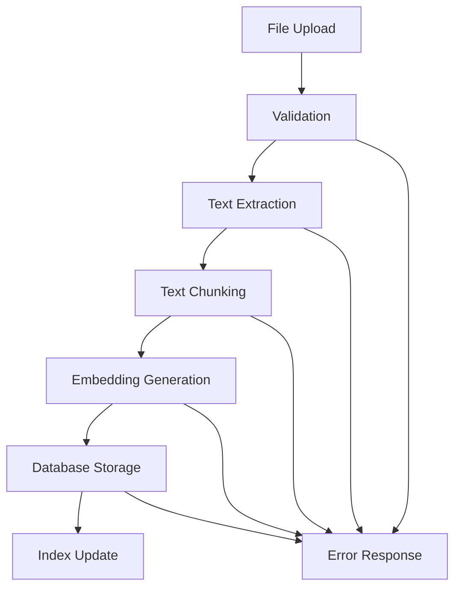

# Backend Architecture Documentation

## Table of Contents

1. [System Overview](#1-system-overview)
2. [Architecture Patterns](#2-architecture-patterns)
3. [Service Layer Design](#3-service-layer-design)
4. [Data Processing Pipeline](#4-data-processing-pipeline)
5. [AI Integration Layer](#5-ai-integration-layer)
6. [External API Management](#6-external-api-management)
7. [Security Architecture](#7-security-architecture)
8. [Performance Optimization](#8-performance-optimization)

## 1. System Overview

The Study Assistant backend follows a **modular monolithic architecture** with clear separation of concerns, designed for educational AI assistance with PTIT-specific features.

### 1.1 Core Technology Stack

**Runtime Environment:**

- **Python 3.11+** - Primary backend language
- **Flask 2.3+** - Web framework with modular blueprints
- **Gunicorn** - Production WSGI server (when deployed)

**Data Layer:**

- **PostgreSQL 15+** - Primary database via Supabase
- **pgvector** - Vector similarity search extension
- **Supabase Storage** - File storage and CDN

**AI & Processing:**

- **LM Studio** - Local LLM model serving
- **SentenceTransformers** - Text embedding generation
- **PyPDF2/pdfplumber** - PDF text extraction
- **BeautifulSoup4** - Web content parsing

### 1.2 Directory Structure

```
backend/
├── app/
│   ├── __init__.py              # Flask app factory
│   ├── config.py                # Environment configuration
│   ├── models/                  # Database models
│   │   ├── __init__.py
│   │   ├── user.py
│   │   ├── file.py
│   │   └── chat.py
│   ├── services/                # Business logic layer
│   │   ├── __init__.py
│   │   ├── ai_service.py        # AI model interactions
│   │   ├── file_service.py      # File processing
│   │   ├── query_classifier.py  # Query classification
│   │   ├── web_search_service.py
│   │   └── ptit_service.py      # PTIT integration
│   ├── routes/                  # API endpoints
│   │   ├── __init__.py
│   │   ├── auth.py
│   │   ├── files.py
│   │   ├── chat.py
│   │   └── ptit.py
│   └── utils/                   # Utility functions
│       ├── __init__.py
│       ├── decorators.py
│       └── helpers.py
├── requirements.txt
└── run.py                       # Application entry point
```

## 2. Architecture Patterns

### 2.1 Layered Architecture

The backend implements a **4-layer architecture**:

```
┌─────────────────────────────────────┐
│           API Layer (Routes)        │ ← HTTP endpoints, request validation
├─────────────────────────────────────┤
│         Service Layer               │ ← Business logic, orchestration
├─────────────────────────────────────┤
│         Data Access Layer           │ ← Database operations, models
├─────────────────────────────────────┤
│      External Integration Layer     │ ← AI models, APIs, file storage
└─────────────────────────────────────┘
```

### 2.2 Service-Oriented Design

Each major functionality is encapsulated in a dedicated service:

**Core Services:**

- `AIService` - Manages AI model interactions and response generation
- `FileService` - Handles file upload, processing, and embedding creation
- `QueryClassifier` - Determines appropriate response strategy for user queries
- `WebSearchService` - Performs web searches and content extraction
- `PTITService` - Integrates with PTIT academic systems

### 2.3 Dependency Injection Pattern

Services are instantiated with their dependencies, enabling:

- **Testability**: Easy mocking of dependencies
- **Flexibility**: Swappable implementations
- **Maintainability**: Clear dependency relationships

```python
# Example: AI Service with injected dependencies
class AIService:
    def __init__(self, db_client, embedding_model, llm_client):
        self.db = db_client
        self.embedding_model = embedding_model
        self.llm = llm_client
```

## 3. Service Layer Design

### 3.1 AIService - Core Intelligence

**Responsibilities:**

- Local LLM model management (via LM Studio)
- Context retrieval from vector database
- Response generation with contextual awareness
- Multi-turn conversation handling

**Key Methods:**

```python
class AIService:
    async def generate_response(self, user_query, chat_history, user_id)
    async def get_relevant_context(self, query_embedding, user_id)
    async def classify_query_type(self, user_query)
    def create_context_prompt(self, query, context_docs, chat_history)
```

**Context Retrieval Strategy:**

1. Generate embedding for user query
2. Perform vector similarity search in user's documents
3. Retrieve top 5 most relevant document chunks
4. Combine with recent chat history for context
5. Format into structured prompt for LLM

### 3.2 FileService - Document Processing

**Processing Pipeline:**

1. **File Validation** - Check format, size, and type
2. **Text Extraction** - Extract content using appropriate parser
3. **Text Chunking** - Split content into semantically meaningful chunks
4. **Embedding Generation** - Create vector embeddings for each chunk
5. **Database Storage** - Store file metadata and embeddings

**Chunking Strategy:**

- **Chunk Size**: 500-1000 characters
- **Overlap**: 100 characters between chunks
- **Preservation**: Maintain paragraph and sentence boundaries
- **Metadata**: Include page numbers, section headers

```python
async def process_uploaded_file(self, file_data, user_id):
    # 1. Validate and extract text
    text_content = await self.extract_text(file_data)

    # 2. Create chunks with overlap
    chunks = self.create_text_chunks(text_content)

    # 3. Generate embeddings
    embeddings = await self.generate_embeddings(chunks)

    # 4. Store in database
    await self.store_file_embeddings(chunks, embeddings, user_id)
```

### 3.3 QueryClassifier - Intelligent Routing

**Classification Categories:**

- **Document Query**: Requires context from user's uploaded files
- **Web Search Query**: Needs real-time information from web
- **PTIT Academic Query**: Requires PTIT portal integration
- **General Chat**: Can be answered directly by LLM

**Decision Logic:**

```python
def classify_query(self, user_query: str) -> QueryType:
    # Keywords and patterns for each category
    academic_patterns = ["lịch học", "thời khóa biểu", "điểm", "thi"]
    web_search_patterns = ["tin tức", "thời tiết", "giá", "mới nhất"]

    # Apply classification rules
    if self.contains_academic_keywords(user_query):
        return QueryType.ACADEMIC
    elif self.needs_current_info(user_query):
        return QueryType.WEB_SEARCH
    # ... additional logic
```

### 3.4 WebSearchService - Real-time Information

**Integration with Brave Search API:**

- **Rate Limiting**: 20 requests per hour per user
- **Result Processing**: Extract and summarize top 5 results
- **Caching**: Cache results for 30 minutes to optimize API usage
- **Content Extraction**: Parse HTML content for text summarization

**Search Flow:**

1. Receive search query from classifier
2. Call Brave Search API with optimized parameters
3. Extract content from top results
4. Summarize findings using LLM
5. Combine with context for comprehensive response

## 4. Data Processing Pipeline

### 4.1 Document Processing Workflow



### 4.2 Vector Embedding Pipeline

**Embedding Model**: SentenceTransformers with multilingual support

- **Model**: `paraphrase-multilingual-MiniLM-L12-v2`
- **Dimensions**: 384-dimensional vectors
- **Language Support**: Vietnamese and English
- **Performance**: ~500ms per document chunk

**Storage in PostgreSQL with pgvector:**

```sql
-- Embeddings table structure
CREATE TABLE embeddings (
    id UUID PRIMARY KEY DEFAULT gen_random_uuid(),
    user_id UUID REFERENCES auth.users(id),
    file_id UUID REFERENCES files(id),
    chunk_text TEXT NOT NULL,
    embedding vector(384) NOT NULL,
    metadata JSONB,
    created_at TIMESTAMP DEFAULT NOW()
);

-- Vector similarity index
CREATE INDEX embeddings_user_embedding_idx
ON embeddings USING ivfflat (embedding vector_cosine_ops)
WITH (lists = 100);
```

### 4.3 Real-time Processing Considerations

**Asynchronous Processing:**

- File uploads trigger background processing jobs
- Large files processed in chunks to prevent timeout
- Progress tracking for user feedback
- Error handling with retry mechanisms

**Memory Management:**

- Streaming file processing for large documents
- Temporary file cleanup after processing
- Model loading optimization with caching

## 5. AI Integration Layer

### 5.1 Local LLM Integration (LM Studio)

**Model Configuration:**

- **Primary Model**: Qwen2.5-7B-Instruct
- **Fallback**: Llama2-7B-Chat
- **Server**: LM Studio running on macOS M2
- **Context Window**: 4096 tokens
- **Temperature**: 0.7 for balanced creativity

**API Communication:**

```python
class LMStudioClient:
    def __init__(self, base_url="http://localhost:1234"):
        self.base_url = base_url

    async def generate_response(self, prompt, max_tokens=512):
        payload = {
            "model": "qwen2.5-7b-instruct",
            "messages": [{"role": "user", "content": prompt}],
            "max_tokens": max_tokens,
            "temperature": 0.7,
            "stream": False
        }
        # API call implementation
```

### 5.2 Prompt Engineering

**System Prompt Template:**

```
Bạn là Study Assistant, một trợ lý AI thông minh được thiết kế để hỗ trợ sinh viên PTIT.

Nhiệm vụ của bạn:
- Trả lời câu hỏi học tập dựa trên tài liệu người dùng cung cấp
- Giải thích khái niệm phức tạp một cách dễ hiểu
- Hỗ trợ nghiên cứu và làm bài tập
- Cung cấp thông tin về lịch học và hoạt động PTIT

Nguyên tắc:
- Trả lời bằng tiếng Việt, rõ ràng và chính xác
- Sử dụng thông tin từ tài liệu được cung cấp khi có thể
- Thừa nhận khi không biết thông tin
- Khuyến khích tư duy phê phán và học tập độc lập

Context từ tài liệu: {document_context}
Lịch sử trò chuyện: {chat_history}
Câu hỏi: {user_query}
```

### 5.3 Context Management

**Context Window Optimization:**

- **Priority Order**: Recent chat > Relevant documents > System prompt
- **Token Counting**: Prevent context overflow with smart truncation
- **Context Refresh**: Clear old context for new topics

## 6. External API Management

### 6.1 Brave Search Integration

**API Configuration:**

```python
class BraveSearchAPI:
    def __init__(self, api_key):
        self.api_key = api_key
        self.base_url = "https://api.search.brave.com/res/v1/web/search"
        self.rate_limiter = RateLimiter(max_calls=20, period=3600)

    async def search(self, query, country="VN", lang="vi"):
        params = {
            "q": query,
            "country": country,
            "search_lang": lang,
            "count": 5,
            "safesearch": "moderate"
        }
        # Implementation with rate limiting
```

### 6.2 PTIT Portal Integration

**Academic Data Sources:**

- Student schedule access
- Exam timetables
- Grade information
- Course announcements

**Authentication Flow:**

- OAuth-style integration with PTIT SSO
- Token management and refresh
- Secure credential storage

### 6.3 Supabase Integration

**Database Operations:**

```python
class SupabaseClient:
    def __init__(self, url, key):
        self.client = create_client(url, key)

    async def store_embedding(self, embedding_data):
        result = await self.client.table('embeddings').insert(embedding_data).execute()
        return result

    async def similarity_search(self, query_embedding, user_id, limit=5):
        # Vector similarity search implementation
        pass
```

## 7. Security Architecture

### 7.1 Authentication & Authorization

**JWT Token Management:**

- Access tokens: 1 hour expiry
- Refresh tokens: 7 days expiry
- Secure HTTP-only cookies in production
- Token blacklisting for logout

**User Data Isolation:**

- All queries filtered by `user_id`
- Row-level security in Supabase
- API endpoints protected with decorators

```python
@jwt_required()
def protected_endpoint():
    user_id = get_jwt_identity()
    # User-specific operations only
```

### 7.2 Data Security

**Encryption:**

- TLS 1.3 for all API communications
- Database connections encrypted
- File upload scanning for malware

**Privacy Controls:**

- User data deletion on account removal
- No cross-user data access
- Audit logging for sensitive operations

### 7.3 API Security

**Rate Limiting:**

```python
# Per endpoint rate limits
RATE_LIMITS = {
    'chat': '60/minute',
    'file_upload': '10/hour',
    'web_search': '20/hour'
}
```

**Input Validation:**

- Request payload validation with Marshmallow
- File type and size restrictions
- SQL injection prevention with parameterized queries

## 8. Performance Optimization

### 8.1 Database Optimization

**Vector Index Tuning:**

```sql
-- Optimized vector search with proper indexing
SELECT chunk_text, (embedding <=> $1) AS similarity
FROM embeddings
WHERE user_id = $2
ORDER BY embedding <=> $1
LIMIT 5;
```

**Connection Pooling:**

- Maximum 20 concurrent database connections
- Connection lifecycle management
- Query optimization with prepared statements

### 8.2 Caching Strategy

**Multi-level Caching:**

1. **Application Cache**: Recent AI responses (30 minutes)
2. **Database Cache**: Query result caching
3. **API Cache**: External API responses (varies by type)

**Cache Implementation:**

```python
from functools import lru_cache
import redis

# In-memory caching for frequent operations
@lru_cache(maxsize=100)
def get_embedding_model():
    return SentenceTransformer('paraphrase-multilingual-MiniLM-L12-v2')

# Redis for distributed caching (production)
redis_client = redis.Redis(host='localhost', port=6379, db=0)
```

### 8.3 Scalability Considerations

**Horizontal Scaling:**

- Stateless API design enables load balancing
- Database read replicas for query performance
- Microservice decomposition path identified

**Resource Management:**

- Model loading optimization
- Memory usage monitoring
- Background job processing with Celery (future)

---

## Conclusion

The backend architecture provides a robust, scalable foundation for the Study Assistant platform. The modular design allows for independent development and testing of components while maintaining system coherence through well-defined interfaces.

**Key Strengths:**

- Clear separation of concerns
- Comprehensive AI integration
- Strong security posture
- Performance optimization
- Extensible design for future features

**Future Enhancements:**

- Microservice decomposition
- Advanced caching with Redis
- Real-time notifications with WebSockets
- Advanced monitoring and metrics

→ **Related Documentation:**

- [API Documentation](./api-documentation.md) - Detailed endpoint specifications
- [Database Design](./database-design.md) - Schema and data flow details
- [Security Report](./security-report.md) - Comprehensive security analysis
