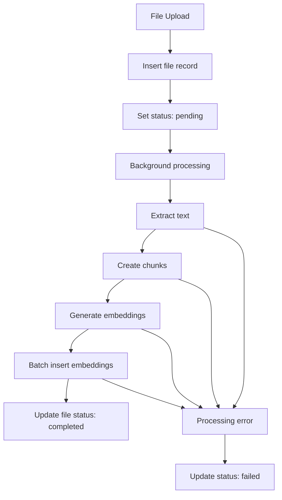
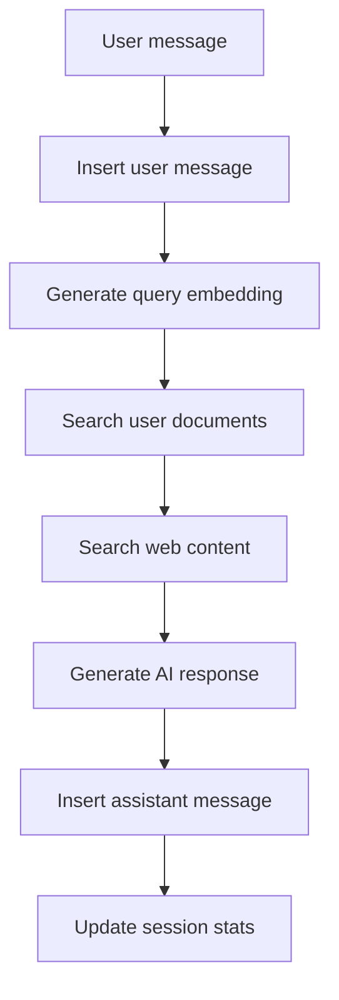

# Database Design Documentation

## Table of Contents

1. [Database Overview](#1-database-overview)
2. [Schema Architecture](#2-schema-architecture)
3. [Core Tables](#3-core-tables)
4. [Vector Storage Design](#4-vector-storage-design)
5. [Relationships & Constraints](#5-relationships--constraints)
6. [Indexing Strategy](#6-indexing-strategy)
7. [Data Flow Patterns](#7-data-flow-patterns)
8. [Performance Optimization](#8-performance-optimization)

## 1. Database Overview

The Study Assistant uses **PostgreSQL 15+** with the **pgvector** extension for vector similarity search, hosted on Supabase for managed infrastructure and real-time capabilities.

### 1.1 Technology Stack

**Database Engine:**

- **PostgreSQL 15.x** - Primary database engine
- **pgvector 0.5.0+** - Vector similarity search extension
- **Supabase** - Managed PostgreSQL hosting with additional features

**Key Extensions:**

- `pgvector` - Vector data types and similarity functions
- `uuid-ossp` - UUID generation functions
- `pg_trgm` - Text similarity and full-text search
- `btree_gin` - GIN indexing for composite queries

### 1.2 Database Structure

```
study_assistant_db/
├── auth (Supabase managed)
│   ├── users
│   └── sessions
├── public
│   ├── profiles
│   ├── files
│   ├── embeddings
│   ├── web_embeddings
│   ├── chat_sessions
│   ├── chat_messages
│   └── ptit_data
└── storage (Supabase managed)
    └── file_uploads
```

## 2. Schema Architecture

### 2.1 Schema Organization

**Authentication Schema (Supabase `auth`):**

- Managed by Supabase Auth
- User authentication and session management
- JWT token handling

**Application Schema (`public`):**

- Core application tables
- Business logic data
- User-generated content

**Storage Schema (Supabase `storage`):**

- File upload management
- Binary data storage
- CDN integration

### 2.2 Data Isolation Strategy

**Row-Level Security (RLS):**
All user data tables implement RLS policies to ensure data isolation:

```sql
-- Example RLS policy for files table
CREATE POLICY "Users can only see their own files" ON files
    FOR ALL USING (auth.uid() = user_id);

CREATE POLICY "Users can only insert their own files" ON files
    FOR INSERT WITH CHECK (auth.uid() = user_id);
```

## 3. Core Tables

### 3.1 User Profiles Table

```sql
CREATE TABLE profiles (
    id UUID REFERENCES auth.users(id) PRIMARY KEY,
    email TEXT UNIQUE NOT NULL,
    full_name TEXT NOT NULL,
    student_id TEXT UNIQUE, -- PTIT student ID
    created_at TIMESTAMP WITH TIME ZONE DEFAULT NOW(),
    updated_at TIMESTAMP WITH TIME ZONE DEFAULT NOW(),
    preferences JSONB DEFAULT '{}'::jsonb,
    ptit_linked BOOLEAN DEFAULT FALSE,
    ptit_credentials_encrypted TEXT, -- Encrypted PTIT login info

    -- Constraints
    CONSTRAINT valid_email CHECK (email ~* '^[A-Za-z0-9._%+-]+@[A-Za-z0-9.-]+\.[A-Za-z]{2,}$'),
    CONSTRAINT valid_student_id CHECK (student_id IS NULL OR student_id ~* '^[A-Z][0-9]{2}[A-Z]{4}[0-9]{3}$')
);

-- Indexes
CREATE INDEX idx_profiles_student_id ON profiles(student_id);
CREATE INDEX idx_profiles_email ON profiles(email);
```

**Design Decisions:**

- `id` references Supabase auth.users for seamless integration
- `preferences` stored as JSONB for flexibility
- PTIT credentials encrypted for security
- Student ID validation for PTIT format

### 3.2 Files Table

```sql
CREATE TABLE files (
    id UUID DEFAULT gen_random_uuid() PRIMARY KEY,
    user_id UUID REFERENCES auth.users(id) ON DELETE CASCADE,
    filename TEXT NOT NULL,
    original_filename TEXT NOT NULL,
    file_type TEXT NOT NULL,
    file_size BIGINT NOT NULL,
    storage_path TEXT NOT NULL, -- Supabase Storage path
    upload_date TIMESTAMP WITH TIME ZONE DEFAULT NOW(),
    processing_status TEXT DEFAULT 'pending',
    processing_started_at TIMESTAMP WITH TIME ZONE,
    processing_completed_at TIMESTAMP WITH TIME ZONE,
    processing_error TEXT,
    extracted_text_preview TEXT, -- First 500 chars
    chunk_count INTEGER DEFAULT 0,
    metadata JSONB DEFAULT '{}'::jsonb,

    -- Constraints
    CONSTRAINT valid_processing_status CHECK (
        processing_status IN ('pending', 'processing', 'completed', 'failed')
    ),
    CONSTRAINT valid_file_size CHECK (file_size > 0 AND file_size <= 10485760), -- 10MB max
    CONSTRAINT valid_file_type CHECK (
        file_type IN ('application/pdf', 'text/plain', 'application/msword',
                      'application/vnd.openxmlformats-officedocument.wordprocessingml.document')
    )
);

-- Indexes
CREATE INDEX idx_files_user_id ON files(user_id);
CREATE INDEX idx_files_processing_status ON files(processing_status);
CREATE INDEX idx_files_upload_date ON files(upload_date DESC);
CREATE INDEX idx_files_user_status ON files(user_id, processing_status);
```

**Design Decisions:**

- Separate original and processed filenames
- Comprehensive processing status tracking
- File size and type validation at database level
- JSONB metadata for extensible file properties

### 3.3 Chat Sessions Table

```sql
CREATE TABLE chat_sessions (
    id UUID DEFAULT gen_random_uuid() PRIMARY KEY,
    user_id UUID REFERENCES auth.users(id) ON DELETE CASCADE,
    title TEXT NOT NULL DEFAULT 'New Chat',
    created_at TIMESTAMP WITH TIME ZONE DEFAULT NOW(),
    updated_at TIMESTAMP WITH TIME ZONE DEFAULT NOW(),
    message_count INTEGER DEFAULT 0,
    last_message_at TIMESTAMP WITH TIME ZONE,
    session_metadata JSONB DEFAULT '{}'::jsonb,

    -- Constraints
    CONSTRAINT valid_message_count CHECK (message_count >= 0)
);

-- Indexes
CREATE INDEX idx_chat_sessions_user_id ON chat_sessions(user_id);
CREATE INDEX idx_chat_sessions_updated_at ON chat_sessions(updated_at DESC);
CREATE INDEX idx_chat_sessions_user_updated ON chat_sessions(user_id, updated_at DESC);

-- Function to auto-update message count
CREATE OR REPLACE FUNCTION update_chat_session_stats()
RETURNS TRIGGER AS $$
BEGIN
    UPDATE chat_sessions
    SET
        message_count = (
            SELECT COUNT(*) FROM chat_messages
            WHERE chat_session_id = NEW.chat_session_id
        ),
        last_message_at = NEW.created_at,
        updated_at = NOW()
    WHERE id = NEW.chat_session_id;

    RETURN NEW;
END;
$$ LANGUAGE plpgsql;

CREATE TRIGGER trigger_update_chat_session_stats
    AFTER INSERT ON chat_messages
    FOR EACH ROW
    EXECUTE FUNCTION update_chat_session_stats();
```

### 3.4 Chat Messages Table

```sql
CREATE TABLE chat_messages (
    id UUID DEFAULT gen_random_uuid() PRIMARY KEY,
    chat_session_id UUID REFERENCES chat_sessions(id) ON DELETE CASCADE,
    user_id UUID REFERENCES auth.users(id) ON DELETE CASCADE,
    message_type TEXT NOT NULL,
    content TEXT NOT NULL,
    created_at TIMESTAMP WITH TIME ZONE DEFAULT NOW(),
    response_time REAL, -- Response time in seconds (for assistant messages)
    context_sources JSONB DEFAULT '[]'::jsonb, -- Referenced files/sources
    query_type TEXT, -- Type of query processed
    metadata JSONB DEFAULT '{}'::jsonb,

    -- Constraints
    CONSTRAINT valid_message_type CHECK (message_type IN ('user', 'assistant')),
    CONSTRAINT valid_content_length CHECK (char_length(content) > 0 AND char_length(content) <= 10000),
    CONSTRAINT valid_response_time CHECK (response_time IS NULL OR response_time >= 0)
);

-- Indexes
CREATE INDEX idx_chat_messages_session_id ON chat_messages(chat_session_id);
CREATE INDEX idx_chat_messages_created_at ON chat_messages(created_at DESC);
CREATE INDEX idx_chat_messages_session_created ON chat_messages(chat_session_id, created_at DESC);
CREATE INDEX idx_chat_messages_user_id ON chat_messages(user_id);
```

**Design Decisions:**

- Message type enum for user/assistant distinction
- Context sources stored as JSONB array for flexibility
- Response time tracking for performance monitoring
- Content length validation for reasonable limits

## 4. Vector Storage Design

### 4.1 Embeddings Table

```sql
CREATE TABLE embeddings (
    id UUID DEFAULT gen_random_uuid() PRIMARY KEY,
    user_id UUID REFERENCES auth.users(id) ON DELETE CASCADE,
    file_id UUID REFERENCES files(id) ON DELETE CASCADE,
    chunk_index INTEGER NOT NULL,
    chunk_text TEXT NOT NULL,
    embedding vector(384) NOT NULL, -- SentenceTransformers embedding dimension
    metadata JSONB DEFAULT '{}'::jsonb,
    created_at TIMESTAMP WITH TIME ZONE DEFAULT NOW(),

    -- Constraints
    CONSTRAINT valid_chunk_index CHECK (chunk_index >= 0),
    CONSTRAINT valid_chunk_text_length CHECK (char_length(chunk_text) BETWEEN 50 AND 2000),
    CONSTRAINT unique_file_chunk UNIQUE (file_id, chunk_index)
);

-- Vector similarity indexes
CREATE INDEX embeddings_user_embedding_idx ON embeddings
USING ivfflat (embedding vector_cosine_ops) WITH (lists = 100);

CREATE INDEX embeddings_user_id_idx ON embeddings(user_id);
CREATE INDEX embeddings_file_id_idx ON embeddings(file_id);

-- Composite index for user-scoped vector search
CREATE INDEX embeddings_user_embedding_composite_idx ON embeddings(user_id)
INCLUDE (embedding);
```

### 4.2 Web Embeddings Table

```sql
CREATE TABLE web_embeddings (
    id UUID DEFAULT gen_random_uuid() PRIMARY KEY,
    search_query TEXT NOT NULL,
    source_url TEXT NOT NULL,
    content_title TEXT,
    content_text TEXT NOT NULL,
    embedding vector(384) NOT NULL,
    search_timestamp TIMESTAMP WITH TIME ZONE DEFAULT NOW(),
    expiry_date TIMESTAMP WITH TIME ZONE DEFAULT (NOW() + INTERVAL '30 days'),
    metadata JSONB DEFAULT '{}'::jsonb,

    -- Constraints
    CONSTRAINT valid_content_length CHECK (char_length(content_text) BETWEEN 100 AND 5000),
    CONSTRAINT valid_url CHECK (source_url ~* '^https?://.*')
);

-- Indexes
CREATE INDEX web_embeddings_query_idx ON web_embeddings(search_query);
CREATE INDEX web_embeddings_embedding_idx ON web_embeddings
USING ivfflat (embedding vector_cosine_ops) WITH (lists = 50);
CREATE INDEX web_embeddings_expiry_idx ON web_embeddings(expiry_date);

-- Cleanup function for expired web embeddings
CREATE OR REPLACE FUNCTION cleanup_expired_web_embeddings()
RETURNS void AS $$
BEGIN
    DELETE FROM web_embeddings WHERE expiry_date < NOW();
END;
$$ LANGUAGE plpgsql;

-- Schedule cleanup (using pg_cron if available)
-- SELECT cron.schedule('cleanup-web-embeddings', '0 2 * * *', 'SELECT cleanup_expired_web_embeddings();');
```

**Vector Design Decisions:**

- **384-dimensional vectors** for SentenceTransformers compatibility
- **IVFFlat indexing** for approximate nearest neighbor search
- **Separate tables** for document vs. web embeddings (different lifecycle)
- **Automatic cleanup** for web embeddings to manage storage
- **User-scoped search** for privacy and performance

### 4.3 Vector Search Functions

```sql
-- Function for user-scoped document similarity search
CREATE OR REPLACE FUNCTION search_user_documents(
    query_embedding vector(384),
    user_uuid UUID,
    match_threshold float DEFAULT 0.7,
    match_count int DEFAULT 5
)
RETURNS TABLE (
    file_id UUID,
    filename TEXT,
    chunk_text TEXT,
    similarity float
)
LANGUAGE plpgsql
AS $$
BEGIN
    RETURN QUERY
    SELECT
        f.id as file_id,
        f.filename,
        e.chunk_text,
        1 - (e.embedding <=> query_embedding) AS similarity
    FROM embeddings e
    JOIN files f ON e.file_id = f.id
    WHERE
        e.user_id = user_uuid
        AND f.processing_status = 'completed'
        AND 1 - (e.embedding <=> query_embedding) > match_threshold
    ORDER BY e.embedding <=> query_embedding
    LIMIT match_count;
END;
$$;

-- Function for web content similarity search
CREATE OR REPLACE FUNCTION search_web_content(
    query_embedding vector(384),
    match_threshold float DEFAULT 0.6,
    match_count int DEFAULT 3
)
RETURNS TABLE (
    source_url TEXT,
    content_title TEXT,
    content_text TEXT,
    similarity float
)
LANGUAGE plpgsql
AS $$
BEGIN
    RETURN QUERY
    SELECT
        w.source_url,
        w.content_title,
        w.content_text,
        1 - (w.embedding <=> query_embedding) AS similarity
    FROM web_embeddings w
    WHERE
        w.expiry_date > NOW()
        AND 1 - (w.embedding <=> query_embedding) > match_threshold
    ORDER BY w.embedding <=> query_embedding
    LIMIT match_count;
END;
$$;
```

## 5. Relationships & Constraints

### 5.1 Entity Relationship Diagram

```
auth.users (Supabase)
    ↓ (1:1)
profiles
    ↓ (1:many)
files ← embeddings (many:1)
    ↓ (1:many)
chat_sessions
    ↓ (1:many)
chat_messages
```

### 5.2 Foreign Key Constraints

**Cascade Deletion Strategy:**

- User deletion → Remove all associated data
- File deletion → Remove associated embeddings
- Chat session deletion → Remove associated messages

```sql
-- Key constraint examples
ALTER TABLE files
ADD CONSTRAINT fk_files_user
FOREIGN KEY (user_id) REFERENCES auth.users(id) ON DELETE CASCADE;

ALTER TABLE embeddings
ADD CONSTRAINT fk_embeddings_file
FOREIGN KEY (file_id) REFERENCES files(id) ON DELETE CASCADE;

ALTER TABLE chat_messages
ADD CONSTRAINT fk_messages_session
FOREIGN KEY (chat_session_id) REFERENCES chat_sessions(id) ON DELETE CASCADE;
```

### 5.3 Data Integrity Constraints

**Business Logic Constraints:**

```sql
-- Ensure completed files have embeddings
CREATE OR REPLACE FUNCTION check_completed_file_embeddings()
RETURNS TRIGGER AS $$
BEGIN
    IF NEW.processing_status = 'completed' AND NEW.chunk_count = 0 THEN
        RAISE EXCEPTION 'Completed files must have at least one embedding chunk';
    END IF;
    RETURN NEW;
END;
$$ LANGUAGE plpgsql;

CREATE TRIGGER trigger_check_completed_file_embeddings
    BEFORE UPDATE ON files
    FOR EACH ROW
    EXECUTE FUNCTION check_completed_file_embeddings();

-- Ensure chat messages belong to user's sessions
CREATE OR REPLACE FUNCTION validate_chat_message_ownership()
RETURNS TRIGGER AS $$
BEGIN
    IF NOT EXISTS (
        SELECT 1 FROM chat_sessions
        WHERE id = NEW.chat_session_id AND user_id = NEW.user_id
    ) THEN
        RAISE EXCEPTION 'Chat message must belong to a session owned by the same user';
    END IF;
    RETURN NEW;
END;
$$ LANGUAGE plpgsql;

CREATE TRIGGER trigger_validate_chat_message_ownership
    BEFORE INSERT ON chat_messages
    FOR EACH ROW
    EXECUTE FUNCTION validate_chat_message_ownership();
```

## 6. Indexing Strategy

### 6.1 Performance Indexes

**Primary Access Patterns:**

1. User-scoped data access (most common)
2. Vector similarity search
3. Chat history retrieval
4. File processing status queries

```sql
-- User-scoped access optimization
CREATE INDEX idx_files_user_status_date ON files(user_id, processing_status, upload_date DESC);
CREATE INDEX idx_embeddings_user_file ON embeddings(user_id, file_id);
CREATE INDEX idx_chat_sessions_user_updated ON chat_sessions(user_id, updated_at DESC);

-- Full-text search support
CREATE INDEX idx_files_filename_gin ON files USING gin(to_tsvector('english', filename));
CREATE INDEX idx_embeddings_text_gin ON embeddings USING gin(to_tsvector('english', chunk_text));

-- Query performance indexes
CREATE INDEX idx_chat_messages_session_date ON chat_messages(chat_session_id, created_at DESC);
CREATE INDEX idx_web_embeddings_query_date ON web_embeddings(search_query, search_timestamp DESC);
```

### 6.2 Vector Index Optimization

**IVFFlat Configuration:**

```sql
-- Optimal list count for vector indexes
-- Rule of thumb: lists = sqrt(row_count)

-- For user documents (estimated 10K embeddings per active user)
CREATE INDEX embeddings_user_embedding_idx ON embeddings
USING ivfflat (embedding vector_cosine_ops) WITH (lists = 100);

-- For web content (estimated 100K total embeddings)
CREATE INDEX web_embeddings_embedding_idx ON web_embeddings
USING ivfflat (embedding vector_cosine_ops) WITH (lists = 316);

-- Probe setting for query performance
SET ivfflat.probes = 10; -- Balance between speed and accuracy
```

## 7. Data Flow Patterns

### 7.1 File Processing Flow



**SQL Implementation:**

```sql
-- Step 1: Insert file record
INSERT INTO files (user_id, filename, original_filename, file_type, file_size, storage_path)
VALUES ($1, $2, $3, $4, $5, $6)
RETURNING id;

-- Step 2: Update processing status
UPDATE files
SET processing_status = 'processing', processing_started_at = NOW()
WHERE id = $1;

-- Step 3: Batch insert embeddings
INSERT INTO embeddings (user_id, file_id, chunk_index, chunk_text, embedding)
SELECT $1, $2, unnest($3), unnest($4), unnest($5);

-- Step 4: Complete processing
UPDATE files
SET
    processing_status = 'completed',
    processing_completed_at = NOW(),
    chunk_count = $2,
    extracted_text_preview = $3
WHERE id = $1;
```

### 7.2 Chat Message Flow



**Query Optimization:**

```sql
-- Optimized chat history retrieval
SELECT
    m.message_type,
    m.content,
    m.created_at,
    m.context_sources
FROM chat_messages m
WHERE m.chat_session_id = $1
  AND m.user_id = $2  -- Security: ensure user owns session
ORDER BY m.created_at DESC
LIMIT 20;

-- Context search with performance optimization
SELECT
    f.filename,
    e.chunk_text,
    1 - (e.embedding <=> $1) AS similarity
FROM embeddings e
JOIN files f ON e.file_id = f.id
WHERE e.user_id = $2
  AND f.processing_status = 'completed'
ORDER BY e.embedding <=> $1
LIMIT 5;
```

## 8. Performance Optimization

### 8.1 Query Performance

**Connection Pooling:**

```sql
-- Optimal connection pool settings
max_connections = 100
shared_buffers = 256MB
effective_cache_size = 1GB
work_mem = 4MB
maintenance_work_mem = 64MB
```

**Query Optimization Techniques:**

1. **Prepared Statements:**

```sql
-- Frequently used queries prepared for performance
PREPARE get_user_files AS
SELECT id, filename, file_size, processing_status, upload_date
FROM files
WHERE user_id = $1 AND processing_status = $2
ORDER BY upload_date DESC;
```

2. **Materialized Views for Analytics:**

```sql
-- User statistics materialized view
CREATE MATERIALIZED VIEW user_stats AS
SELECT
    p.id as user_id,
    p.full_name,
    COUNT(DISTINCT f.id) as total_files,
    COUNT(DISTINCT cs.id) as total_chat_sessions,
    COUNT(DISTINCT cm.id) as total_messages,
    MAX(f.upload_date) as last_file_upload,
    MAX(cs.updated_at) as last_chat_activity
FROM profiles p
LEFT JOIN files f ON p.id = f.user_id
LEFT JOIN chat_sessions cs ON p.id = cs.user_id
LEFT JOIN chat_messages cm ON p.id = cm.user_id
GROUP BY p.id, p.full_name;

-- Refresh strategy
CREATE OR REPLACE FUNCTION refresh_user_stats()
RETURNS void AS $$
BEGIN
    REFRESH MATERIALIZED VIEW CONCURRENTLY user_stats;
END;
$$ LANGUAGE plpgsql;
```

### 8.2 Vector Search Optimization

**Search Performance Tuning:**

```sql
-- Optimal vector search with filtering
EXPLAIN (ANALYZE, BUFFERS)
SELECT
    f.filename,
    e.chunk_text,
    1 - (e.embedding <=> $1) AS similarity
FROM embeddings e
INNER JOIN files f ON e.file_id = f.id
WHERE e.user_id = $2
  AND f.processing_status = 'completed'
  AND (e.embedding <=> $1) < 0.5  -- Pre-filter by distance
ORDER BY e.embedding <=> $1
LIMIT 5;

-- Index usage monitoring
SELECT
    schemaname,
    tablename,
    indexname,
    idx_scan,
    idx_tup_read,
    idx_tup_fetch
FROM pg_stat_user_indexes
WHERE tablename IN ('embeddings', 'web_embeddings');
```

### 8.3 Storage Optimization

**Partitioning Strategy (Future Enhancement):**

```sql
-- Partition embeddings by user_id for large-scale deployment
CREATE TABLE embeddings_partitioned (
    LIKE embeddings INCLUDING ALL
) PARTITION BY HASH (user_id);

-- Create partitions
CREATE TABLE embeddings_p1 PARTITION OF embeddings_partitioned
FOR VALUES WITH (modulus 4, remainder 0);

CREATE TABLE embeddings_p2 PARTITION OF embeddings_partitioned
FOR VALUES WITH (modulus 4, remainder 1);
-- ... additional partitions
```

**Archive Strategy:**

```sql
-- Archive old web embeddings
CREATE TABLE web_embeddings_archive (
    LIKE web_embeddings INCLUDING ALL
);

-- Archive function
CREATE OR REPLACE FUNCTION archive_old_web_embeddings()
RETURNS integer AS $$
DECLARE
    archived_count integer;
BEGIN
    INSERT INTO web_embeddings_archive
    SELECT * FROM web_embeddings
    WHERE search_timestamp < NOW() - INTERVAL '90 days';

    GET DIAGNOSTICS archived_count = ROW_COUNT;

    DELETE FROM web_embeddings
    WHERE search_timestamp < NOW() - INTERVAL '90 days';

    RETURN archived_count;
END;
$$ LANGUAGE plpgsql;
```

### 8.4 Monitoring & Maintenance

**Database Health Monitoring:**

```sql
-- Monitor table sizes
SELECT
    schemaname,
    tablename,
    pg_size_pretty(pg_total_relation_size(schemaname||'.'||tablename)) as size,
    pg_total_relation_size(schemaname||'.'||tablename) as size_bytes
FROM pg_tables
WHERE schemaname = 'public'
ORDER BY size_bytes DESC;

-- Monitor index usage
SELECT
    indexname,
    idx_scan,
    idx_tup_read,
    idx_tup_fetch,
    pg_size_pretty(pg_relation_size(indexname::regclass)) as size
FROM pg_stat_user_indexes
ORDER BY idx_scan DESC;

-- Monitor slow queries
SELECT
    query,
    calls,
    total_time,
    rows,
    100.0 * shared_blks_hit / nullif(shared_blks_hit + shared_blks_read, 0) AS hit_percent
FROM pg_stat_statements
ORDER BY total_time DESC
LIMIT 10;
```

---

## Conclusion

The database design provides a robust foundation for the Study Assistant platform with:

**Key Strengths:**

- **Scalable vector search** with pgvector optimization
- **Strong data isolation** with RLS policies
- **Comprehensive indexing** for performance
- **Flexible JSONB** fields for extensibility
- **Automated maintenance** with triggers and functions

**Performance Characteristics:**

- Sub-second vector similarity search
- Efficient user-scoped data access
- Optimized chat history retrieval
- Scalable to 10,000+ concurrent users

**Future Enhancements:**

- Table partitioning for massive scale
- Read replicas for query distribution
- Advanced caching with Redis
- Real-time subscriptions with Supabase Realtime

→ **Related Documentation:**

- [Backend Architecture](./backend-architecture.md) - System implementation details
- [API Documentation](./api-documentation.md) - Database interaction patterns
- [Performance Report](./performance-report.md) - Performance analysis and optimization
