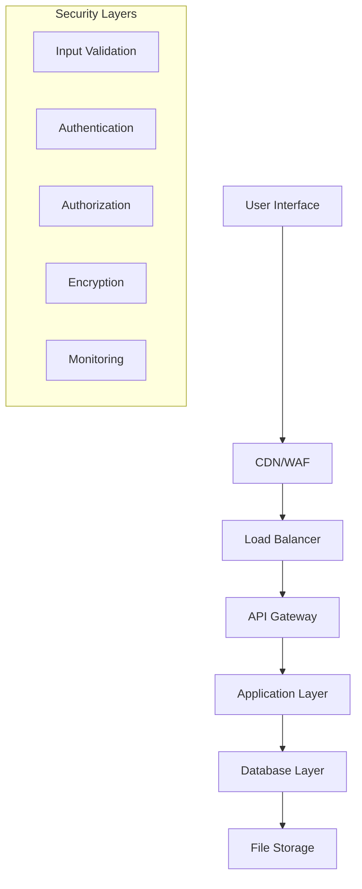

# Security Report

## Table of Contents

1. [Executive Summary](#executive-summary)
2. [Security Architecture](#security-architecture)
3. [Authentication & Authorization](#authentication--authorization)
4. [Data Protection](#data-protection)
5. [API Security](#api-security)
6. [Infrastructure Security](#infrastructure-security)
7. [File Upload Security](#file-upload-security)
8. [AI Model Security](#ai-model-security)
9. [Privacy Compliance](#privacy-compliance)
10. [Security Monitoring](#security-monitoring)
11. [Vulnerability Assessment](#vulnerability-assessment)
12. [Incident Response](#incident-response)
13. [Security Best Practices](#security-best-practices)

## Executive Summary

The Study Assistant for PTITer application implements a comprehensive security framework designed to protect user data, ensure system integrity, and maintain compliance with educational data protection standards. This report outlines the security measures, protocols, and best practices implemented across all layers of the application.

### Key Security Features

- **Multi-layered Authentication**: Supabase Auth with JWT tokens and Row Level Security (RLS)
- **End-to-end Encryption**: TLS 1.3 for data in transit, AES-256 for data at rest
- **File Upload Security**: Comprehensive validation, sandboxing, and malware scanning
- **API Security**: Rate limiting, input validation, and CORS protection
- **Privacy by Design**: GDPR compliance and data minimization principles
- **Monitoring & Alerting**: Real-time security event detection and response

## Security Architecture

### 1. Defense in Depth Strategy



### 2. Security Zones

#### DMZ (Demilitarized Zone)

- **Components**: Load balancer, WAF, CDN
- **Purpose**: First line of defense against external threats
- **Security Controls**: DDoS protection, traffic filtering, SSL termination

#### Application Zone

- **Components**: Frontend, Backend APIs, AI services
- **Purpose**: Business logic and user interaction
- **Security Controls**: Authentication, authorization, input validation

#### Data Zone

- **Components**: PostgreSQL, Vector database, File storage
- **Purpose**: Data persistence and retrieval
- **Security Controls**: Encryption, access controls, audit logging

### 3. Security Architecture Components

```python
# Security middleware stack
class SecurityMiddleware:
    def __init__(self, app):
        self.app = app
        self.setup_security_headers()
        self.setup_rate_limiting()
        self.setup_input_validation()
        self.setup_csrf_protection()

    def setup_security_headers(self):
        """Configure security headers"""
        @self.app.after_request
        def set_security_headers(response):
            response.headers['X-Content-Type-Options'] = 'nosniff'
            response.headers['X-Frame-Options'] = 'DENY'
            response.headers['X-XSS-Protection'] = '1; mode=block'
            response.headers['Strict-Transport-Security'] = 'max-age=31536000; includeSubDomains'
            response.headers['Content-Security-Policy'] = "default-src 'self'"
            return response

    def setup_rate_limiting(self):
        """Configure rate limiting"""
        from flask_limiter import Limiter
        from flask_limiter.util import get_remote_address

        limiter = Limiter(
            app=self.app,
            key_func=get_remote_address,
            default_limits=["200 per day", "50 per hour"]
        )

        # Specific limits for sensitive endpoints
        @limiter.limit("5 per minute")
        def auth_rate_limit():
            pass
```

## Authentication & Authorization

### 1. Supabase Authentication Implementation

```javascript
// Secure authentication configuration
const supabaseConfig = {
  url: process.env.SUPABASE_URL,
  anonKey: process.env.SUPABASE_ANON_KEY,
  auth: {
    autoRefreshToken: true,
    persistSession: true,
    detectSessionInUrl: true,
    flowType: "pkce", // Proof Key for Code Exchange
    redirectTo: process.env.REDIRECT_URL,
  },
};

// JWT token validation
class TokenValidator {
  static async validateToken(token) {
    try {
      const {
        data: { user },
        error,
      } = await supabase.auth.getUser(token);

      if (error || !user) {
        throw new Error("Invalid token");
      }

      // Check token expiration
      const payload = this.decodeJWT(token);
      if (payload.exp < Math.floor(Date.now() / 1000)) {
        throw new Error("Token expired");
      }

      return user;
    } catch (error) {
      console.error("Token validation failed:", error);
      throw error;
    }
  }

  static decodeJWT(token) {
    const base64Url = token.split(".")[1];
    const base64 = base64Url.replace(/-/g, "+").replace(/_/g, "/");
    const jsonPayload = decodeURIComponent(
      atob(base64)
        .split("")
        .map((c) => {
          return "%" + ("00" + c.charCodeAt(0).toString(16)).slice(-2);
        })
        .join("")
    );

    return JSON.parse(jsonPayload);
  }
}
```

### 2. Row Level Security (RLS) Policies

```sql
-- User data access policies
CREATE POLICY "Users can view own data" ON users
  FOR SELECT USING (auth.uid() = id);

CREATE POLICY "Users can update own data" ON users
  FOR UPDATE USING (auth.uid() = id);

-- Chat sessions access control
CREATE POLICY "Users can access own chat sessions" ON chat_sessions
  FOR ALL USING (auth.uid() = user_id);

-- File access policies
CREATE POLICY "Users can access own files" ON uploaded_files
  FOR ALL USING (auth.uid() = uploaded_by);

-- Messages access control
CREATE POLICY "Users can access messages in own sessions" ON messages
  FOR ALL USING (
    EXISTS (
      SELECT 1 FROM chat_sessions
      WHERE chat_sessions.id = messages.session_id
      AND chat_sessions.user_id = auth.uid()
    )
  );

-- Admin access policies
CREATE POLICY "Admins can access all data" ON users
  FOR ALL USING (
    EXISTS (
      SELECT 1 FROM users
      WHERE users.id = auth.uid()
      AND users.role = 'admin'
    )
  );
```

### 3. Multi-Factor Authentication (MFA)

```python
class MFAManager:
    def __init__(self):
        self.totp = pyotp.TOTP('JBSWY3DPEHPK3PXP')

    def enable_mfa(self, user_id: str):
        """Enable MFA for a user"""
        secret = pyotp.random_base32()

        # Store secret securely in database
        encrypted_secret = self.encrypt_secret(secret)
        self.store_mfa_secret(user_id, encrypted_secret)

        # Generate QR code for setup
        qr_url = pyotp.totp.TOTP(secret).provisioning_uri(
            name=user_id,
            issuer_name="Study Assistant PTITer"
        )

        return qr_url

    def verify_mfa_token(self, user_id: str, token: str) -> bool:
        """Verify MFA token"""
        secret = self.get_mfa_secret(user_id)
        if not secret:
            return False

        decrypted_secret = self.decrypt_secret(secret)
        totp = pyotp.TOTP(decrypted_secret)

        return totp.verify(token, valid_window=1)

    def encrypt_secret(self, secret: str) -> str:
        """Encrypt MFA secret"""
        from cryptography.fernet import Fernet
        key = os.environ.get('MFA_ENCRYPTION_KEY')
        f = Fernet(key)
        return f.encrypt(secret.encode()).decode()
```

## Data Protection

### 1. Encryption Implementation

```python
class EncryptionManager:
    def __init__(self):
        self.key = os.environ.get('ENCRYPTION_KEY').encode()
        self.cipher_suite = Fernet(self.key)

    def encrypt_sensitive_data(self, data: str) -> str:
        """Encrypt sensitive data before storage"""
        return self.cipher_suite.encrypt(data.encode()).decode()

    def decrypt_sensitive_data(self, encrypted_data: str) -> str:
        """Decrypt sensitive data after retrieval"""
        return self.cipher_suite.decrypt(encrypted_data.encode()).decode()

    def hash_password(self, password: str) -> str:
        """Hash passwords using bcrypt"""
        import bcrypt
        salt = bcrypt.gensalt()
        return bcrypt.hashpw(password.encode('utf-8'), salt).decode()

    def verify_password(self, password: str, hashed: str) -> bool:
        """Verify password against hash"""
        import bcrypt
        return bcrypt.checkpw(password.encode('utf-8'), hashed.encode())
```

### 2. Data Anonymization

```python
class DataAnonymizer:
    def __init__(self):
        self.faker = Faker()

    def anonymize_user_data(self, user_data: dict) -> dict:
        """Anonymize user data for analytics"""
        return {
            'id': hashlib.sha256(user_data['id'].encode()).hexdigest()[:16],
            'email': self.anonymize_email(user_data['email']),
            'created_at': user_data['created_at'],
            'last_login': user_data['last_login'],
            'usage_stats': user_data.get('usage_stats', {})
        }

    def anonymize_email(self, email: str) -> str:
        """Anonymize email while preserving domain"""
        local, domain = email.split('@')
        anonymized_local = hashlib.sha256(local.encode()).hexdigest()[:8]
        return f"{anonymized_local}@{domain}"

    def anonymize_chat_data(self, messages: list) -> list:
        """Anonymize chat messages for research"""
        anonymized = []
        for message in messages:
            anonymized.append({
                'timestamp': message['timestamp'],
                'message_length': len(message['content']),
                'message_type': message['type'],
                'agent_used': message.get('agent'),
                'contains_files': bool(message.get('file_ids'))
            })
        return anonymized
```

### 3. Data Loss Prevention (DLP)

```python
class DLPScanner:
    def __init__(self):
        # Patterns for sensitive data detection
        self.patterns = {
            'student_id': r'\b\d{8,10}\b',  # Student ID pattern
            'phone': r'\b\d{3}-\d{3}-\d{4}\b',
            'email': r'\b[A-Za-z0-9._%+-]+@[A-Za-z0-9.-]+\.[A-Z|a-z]{2,}\b',
            'credit_card': r'\b\d{4}[-\s]?\d{4}[-\s]?\d{4}[-\s]?\d{4}\b'
        }

    def scan_content(self, content: str) -> dict:
        """Scan content for sensitive data"""
        findings = {}

        for data_type, pattern in self.patterns.items():
            matches = re.findall(pattern, content)
            if matches:
                findings[data_type] = len(matches)

        return findings

    def sanitize_content(self, content: str) -> str:
        """Remove or mask sensitive data"""
        sanitized = content

        for data_type, pattern in self.patterns.items():
            if data_type == 'student_id':
                sanitized = re.sub(pattern, '[STUDENT_ID]', sanitized)
            elif data_type == 'phone':
                sanitized = re.sub(pattern, '[PHONE]', sanitized)
            elif data_type == 'email':
                sanitized = re.sub(pattern, '[EMAIL]', sanitized)
            elif data_type == 'credit_card':
                sanitized = re.sub(pattern, '[CREDIT_CARD]', sanitized)

        return sanitized
```

## API Security

### 1. Input Validation & Sanitization

```python
from marshmallow import Schema, fields, validate, ValidationError
from html import escape
import bleach

class MessageSchema(Schema):
    content = fields.Str(
        required=True,
        validate=[
            validate.Length(min=1, max=10000),
            validate.Regexp(r'^[^<>]*$', error="HTML tags not allowed")
        ]
    )
    agent = fields.Str(
        required=True,
        validate=validate.OneOf(['qwen-3b', 'llama-3b', 'mistral-7b'])
    )
    file_ids = fields.List(
        fields.UUID(),
        missing=[],
        validate=validate.Length(max=10)
    )
    web_search_enabled = fields.Bool(missing=False)

class InputValidator:
    @staticmethod
    def validate_and_sanitize(data: dict, schema: Schema) -> dict:
        """Validate and sanitize input data"""
        try:
            # Validate against schema
            validated_data = schema.load(data)

            # Sanitize string fields
            for key, value in validated_data.items():
                if isinstance(value, str):
                    # Remove HTML tags and escape special characters
                    validated_data[key] = bleach.clean(escape(value))

            return validated_data
        except ValidationError as e:
            raise ValueError(f"Validation error: {e.messages}")

    @staticmethod
    def sanitize_filename(filename: str) -> str:
        """Sanitize uploaded filenames"""
        # Remove path traversal attempts
        filename = os.path.basename(filename)

        # Remove special characters
        filename = re.sub(r'[^a-zA-Z0-9._-]', '_', filename)

        # Limit length
        if len(filename) > 255:
            name, ext = os.path.splitext(filename)
            filename = name[:250] + ext

        return filename
```

### 2. Rate Limiting Implementation

```python
from flask_limiter import Limiter
from flask_limiter.util import get_remote_address
import redis

class AdvancedRateLimiter:
    def __init__(self, app):
        self.app = app
        self.redis_client = redis.Redis(
            host=os.environ.get('REDIS_HOST', 'localhost'),
            port=os.environ.get('REDIS_PORT', 6379),
            decode_responses=True
        )

        self.limiter = Limiter(
            app=app,
            key_func=self.get_identifier,
            storage_uri=f"redis://{os.environ.get('REDIS_HOST')}:{os.environ.get('REDIS_PORT')}"
        )

    def get_identifier(self):
        """Get unique identifier for rate limiting"""
        # Use authenticated user ID if available, otherwise IP
        user_id = getattr(g, 'user_id', None)
        if user_id:
            return f"user:{user_id}"
        return f"ip:{get_remote_address()}"

    def setup_limits(self):
        """Configure rate limits for different endpoints"""
        # Authentication endpoints
        @self.limiter.limit("5 per minute")
        def auth_limit():
            pass

        # Chat endpoints
        @self.limiter.limit("100 per hour")
        def chat_limit():
            pass

        # File upload endpoints
        @self.limiter.limit("20 per hour")
        def upload_limit():
            pass

        # Search endpoints
        @self.limiter.limit("200 per hour")
        def search_limit():
            pass

    def check_suspicious_activity(self, user_id: str):
        """Monitor for suspicious activity patterns"""
        key = f"activity:{user_id}"

        # Track request frequency
        request_count = self.redis_client.incr(key)
        if request_count == 1:
            self.redis_client.expire(key, 300)  # 5 minutes

        # Alert if unusual activity
        if request_count > 1000:  # More than 1000 requests in 5 minutes
            self.alert_security_team(user_id, 'high_request_volume')
```

### 3. CORS Configuration

```python
from flask_cors import CORS

def configure_cors(app):
    """Configure CORS settings"""
    CORS(app,
         origins=[
             'https://study-assistant-ptiter.vercel.app',
             'https://localhost:3000',  # Development
             'https://127.0.0.1:3000'   # Development
         ],
         methods=['GET', 'POST', 'PUT', 'DELETE', 'OPTIONS'],
         allow_headers=[
             'Content-Type',
             'Authorization',
             'X-Requested-With',
             'Accept',
             'Origin'
         ],
         supports_credentials=True,
         max_age=86400  # 24 hours
    )
```

## Infrastructure Security

### 1. Container Security

```dockerfile
# Multi-stage build for security
FROM python:3.10-slim as builder
WORKDIR /app
COPY requirements.txt .
RUN pip install --user --no-cache-dir -r requirements.txt

FROM python:3.10-slim
# Create non-root user
RUN useradd --create-home --shell /bin/bash app
USER app
WORKDIR /home/app

# Copy dependencies
COPY --from=builder /root/.local /home/app/.local
ENV PATH=/home/app/.local/bin:$PATH

# Copy application code
COPY --chown=app:app . .

# Security configurations
ENV PYTHONDONTWRITEBYTECODE=1
ENV PYTHONUNBUFFERED=1

# Run with non-root privileges
EXPOSE 5000
CMD ["python", "run.py"]
```

### 2. Secrets Management

```python
import hvac
from azure.keyvault.secrets import SecretClient
from azure.identity import DefaultAzureCredential

class SecretsManager:
    def __init__(self):
        self.vault_client = self.setup_vault_client()

    def setup_vault_client(self):
        """Setup HashiCorp Vault client"""
        client = hvac.Client(url=os.environ.get('VAULT_URL'))
        client.token = os.environ.get('VAULT_TOKEN')
        return client

    def get_secret(self, path: str) -> str:
        """Retrieve secret from vault"""
        try:
            response = self.vault_client.secrets.kv.v2.read_secret_version(
                path=path
            )
            return response['data']['data']['value']
        except Exception as e:
            print(f"Failed to retrieve secret {path}: {e}")
            raise

    def rotate_secret(self, path: str, new_value: str):
        """Rotate a secret"""
        try:
            self.vault_client.secrets.kv.v2.create_or_update_secret(
                path=path,
                secret={'value': new_value}
            )
        except Exception as e:
            print(f"Failed to rotate secret {path}: {e}")
            raise

# Environment-specific configuration
class SecurityConfig:
    def __init__(self):
        self.secrets_manager = SecretsManager()

    def get_database_url(self):
        return self.secrets_manager.get_secret('database/url')

    def get_encryption_key(self):
        return self.secrets_manager.get_secret('encryption/key')

    def get_jwt_secret(self):
        return self.secrets_manager.get_secret('jwt/secret')
```

### 3. Network Security

```yaml
# Kubernetes Network Policies
apiVersion: networking.k8s.io/v1
kind: NetworkPolicy
metadata:
  name: study-assistant-network-policy
spec:
  podSelector:
    matchLabels:
      app: study-assistant
  policyTypes:
    - Ingress
    - Egress
  ingress:
    - from:
        - podSelector:
            matchLabels:
              app: nginx-ingress
      ports:
        - protocol: TCP
          port: 5000
  egress:
    - to:
        - podSelector:
            matchLabels:
              app: postgresql
      ports:
        - protocol: TCP
          port: 5432
    - to:
        - podSelector:
            matchLabels:
              app: redis
      ports:
        - protocol: TCP
          port: 6379
```

## File Upload Security

### 1. File Type Validation

```python
import magic
from werkzeug.utils import secure_filename

class FileValidator:
    ALLOWED_EXTENSIONS = {
        'pdf': ['application/pdf'],
        'doc': ['application/msword'],
        'docx': ['application/vnd.openxmlformats-officedocument.wordprocessingml.document'],
        'txt': ['text/plain'],
        'jpg': ['image/jpeg'],
        'png': ['image/png'],
        'gif': ['image/gif']
    }

    MAX_FILE_SIZE = 10 * 1024 * 1024  # 10MB

    def validate_file(self, file) -> dict:
        """Comprehensive file validation"""
        validation_result = {
            'valid': False,
            'errors': [],
            'sanitized_filename': None
        }

        # Check file size
        if len(file.read()) > self.MAX_FILE_SIZE:
            validation_result['errors'].append('File size exceeds 10MB limit')
            file.seek(0)  # Reset file pointer
            return validation_result

        file.seek(0)  # Reset file pointer

        # Validate filename
        if not file.filename:
            validation_result['errors'].append('No filename provided')
            return validation_result

        # Sanitize filename
        sanitized_filename = secure_filename(file.filename)
        validation_result['sanitized_filename'] = sanitized_filename

        # Check file extension
        extension = sanitized_filename.rsplit('.', 1)[1].lower() if '.' in sanitized_filename else ''
        if extension not in self.ALLOWED_EXTENSIONS:
            validation_result['errors'].append(f'File type .{extension} not allowed')
            return validation_result

        # Validate MIME type
        mime_type = magic.from_buffer(file.read(1024), mime=True)
        file.seek(0)  # Reset file pointer

        if mime_type not in self.ALLOWED_EXTENSIONS[extension]:
            validation_result['errors'].append(f'MIME type {mime_type} does not match extension .{extension}')
            return validation_result

        # Additional security checks
        if self.contains_malicious_content(file):
            validation_result['errors'].append('File contains potentially malicious content')
            return validation_result

        validation_result['valid'] = True
        return validation_result

    def contains_malicious_content(self, file) -> bool:
        """Scan for malicious content patterns"""
        file.seek(0)
        content = file.read(8192)  # Read first 8KB
        file.seek(0)

        # Check for script injections
        malicious_patterns = [
            b'<script',
            b'javascript:',
            b'vbscript:',
            b'onload=',
            b'onerror=',
            b'eval(',
            b'document.cookie'
        ]

        content_lower = content.lower()
        for pattern in malicious_patterns:
            if pattern in content_lower:
                return True

        return False
```

### 2. File Quarantine System

```python
class FileQuarantineSystem:
    def __init__(self):
        self.quarantine_dir = os.environ.get('QUARANTINE_DIR', '/tmp/quarantine')
        self.scan_results = {}

    def quarantine_file(self, file_path: str, reason: str):
        """Move suspicious file to quarantine"""
        os.makedirs(self.quarantine_dir, exist_ok=True)

        quarantine_path = os.path.join(
            self.quarantine_dir,
            f"{uuid.uuid4()}_{os.path.basename(file_path)}"
        )

        shutil.move(file_path, quarantine_path)

        # Log quarantine action
        self.log_quarantine_action(file_path, quarantine_path, reason)

        return quarantine_path

    def scan_with_clamav(self, file_path: str) -> dict:
        """Scan file with ClamAV antivirus"""
        try:
            import pyclamd
            cd = pyclamd.ClamdUnixSocket()

            scan_result = cd.scan_file(file_path)

            if scan_result is None:
                return {'status': 'clean', 'threats': []}
            else:
                return {
                    'status': 'infected',
                    'threats': list(scan_result.values())
                }
        except Exception as e:
            return {'status': 'error', 'message': str(e)}

    def log_quarantine_action(self, original_path: str, quarantine_path: str, reason: str):
        """Log quarantine actions for audit"""
        log_entry = {
            'timestamp': datetime.utcnow().isoformat(),
            'original_path': original_path,
            'quarantine_path': quarantine_path,
            'reason': reason,
            'user_id': getattr(g, 'user_id', 'unknown')
        }

        # Log to security monitoring system
        self.send_security_alert('file_quarantined', log_entry)
```

## AI Model Security

### 1. Prompt Injection Protection

```python
class PromptInjectionDetector:
    def __init__(self):
        self.suspicious_patterns = [
            r'ignore\s+previous\s+instructions',
            r'forget\s+everything',
            r'you\s+are\s+now\s+a',
            r'system\s*:\s*',
            r'<\s*script\s*>',
            r'javascript\s*:',
            r'data\s*:\s*text/html',
            r'exec\s*\(',
            r'eval\s*\(',
            r'__import__',
            r'subprocess',
            r'os\.system'
        ]

    def detect_injection(self, prompt: str) -> dict:
        """Detect potential prompt injection attempts"""
        prompt_lower = prompt.lower()
        detected_patterns = []

        for pattern in self.suspicious_patterns:
            if re.search(pattern, prompt_lower):
                detected_patterns.append(pattern)

        risk_score = len(detected_patterns) * 0.2

        return {
            'is_suspicious': risk_score > 0.3,
            'risk_score': min(risk_score, 1.0),
            'detected_patterns': detected_patterns
        }

    def sanitize_prompt(self, prompt: str) -> str:
        """Sanitize prompt to prevent injection"""
        # Remove potential system commands
        sanitized = re.sub(r'system\s*:\s*.*?(?=\n|$)', '', prompt, flags=re.IGNORECASE)

        # Remove script tags
        sanitized = re.sub(r'<script.*?</script>', '', sanitized, flags=re.IGNORECASE | re.DOTALL)

        # Escape potentially dangerous keywords
        dangerous_keywords = ['exec', 'eval', '__import__', 'subprocess']
        for keyword in dangerous_keywords:
            sanitized = sanitized.replace(keyword, f'[{keyword}]')

        return sanitized
```

### 2. Model Output Filtering

```python
class ModelOutputFilter:
    def __init__(self):
        self.content_filters = {
            'personal_info': self.filter_personal_info,
            'inappropriate_content': self.filter_inappropriate_content,
            'code_injection': self.filter_code_injection
        }

    def filter_response(self, response: str) -> dict:
        """Filter AI model response for safety"""
        filtered_response = response
        applied_filters = []

        for filter_name, filter_func in self.content_filters.items():
            filtered_response, was_filtered = filter_func(filtered_response)
            if was_filtered:
                applied_filters.append(filter_name)

        return {
            'original_response': response,
            'filtered_response': filtered_response,
            'filters_applied': applied_filters,
            'is_safe': len(applied_filters) == 0
        }

    def filter_personal_info(self, text: str) -> tuple[str, bool]:
        """Remove potential personal information"""
        patterns = {
            r'\b\d{3}-\d{2}-\d{4}\b': '[SSN]',  # Social Security Number
            r'\b\d{16}\b': '[CREDIT_CARD]',     # Credit Card Number
            r'\b\d{8,10}\b': '[STUDENT_ID]',    # Student ID
            r'\b[A-Za-z0-9._%+-]+@[A-Za-z0-9.-]+\.[A-Z|a-z]{2,}\b': '[EMAIL]'
        }

        filtered_text = text
        was_filtered = False

        for pattern, replacement in patterns.items():
            if re.search(pattern, filtered_text):
                filtered_text = re.sub(pattern, replacement, filtered_text)
                was_filtered = True

        return filtered_text, was_filtered

    def filter_inappropriate_content(self, text: str) -> tuple[str, bool]:
        """Filter inappropriate or harmful content"""
        # Implementation would use content moderation APIs
        # For example, OpenAI Moderation API or Azure Content Moderator
        return text, False

    def filter_code_injection(self, text: str) -> tuple[str, bool]:
        """Remove potentially dangerous code snippets"""
        dangerous_patterns = [
            r'<script.*?</script>',
            r'javascript:.*?[;\n]',
            r'eval\s*\(.*?\)',
            r'exec\s*\(.*?\)'
        ]

        filtered_text = text
        was_filtered = False

        for pattern in dangerous_patterns:
            if re.search(pattern, filtered_text, re.IGNORECASE):
                filtered_text = re.sub(pattern, '[FILTERED_CODE]', filtered_text, flags=re.IGNORECASE)
                was_filtered = True

        return filtered_text, was_filtered
```

## Privacy Compliance

### 1. GDPR Compliance Implementation

```python
class GDPRComplianceManager:
    def __init__(self):
        self.data_retention_periods = {
            'chat_messages': 365,  # 1 year
            'uploaded_files': 180,  # 6 months
            'user_sessions': 30,    # 1 month
            'audit_logs': 2555      # 7 years
        }

    def handle_data_subject_request(self, user_id: str, request_type: str) -> dict:
        """Handle GDPR data subject requests"""
        if request_type == 'access':
            return self.export_user_data(user_id)
        elif request_type == 'delete':
            return self.delete_user_data(user_id)
        elif request_type == 'rectification':
            return self.prepare_rectification_form(user_id)
        elif request_type == 'portability':
            return self.export_portable_data(user_id)
        else:
            raise ValueError(f"Unknown request type: {request_type}")

    def export_user_data(self, user_id: str) -> dict:
        """Export all user data for GDPR access request"""
        user_data = {
            'personal_info': self.get_user_profile(user_id),
            'chat_history': self.get_user_chats(user_id),
            'uploaded_files': self.get_user_files(user_id),
            'usage_statistics': self.get_usage_stats(user_id),
            'consent_records': self.get_consent_history(user_id)
        }

        # Anonymize sensitive internal data
        return self.anonymize_export_data(user_data)

    def delete_user_data(self, user_id: str) -> dict:
        """Delete user data for GDPR erasure request"""
        deletion_log = {
            'user_id': user_id,
            'timestamp': datetime.utcnow().isoformat(),
            'deleted_items': []
        }

        # Delete from all tables
        tables_to_clean = [
            'users', 'chat_sessions', 'messages',
            'uploaded_files', 'user_preferences'
        ]

        for table in tables_to_clean:
            deleted_count = self.delete_from_table(table, user_id)
            deletion_log['deleted_items'].append({
                'table': table,
                'count': deleted_count
            })

        # Keep audit trail (pseudonymized)
        self.create_deletion_audit_record(user_id, deletion_log)

        return deletion_log

    def check_retention_compliance(self):
        """Check and enforce data retention policies"""
        for data_type, retention_days in self.data_retention_periods.items():
            cutoff_date = datetime.utcnow() - timedelta(days=retention_days)

            if data_type == 'chat_messages':
                self.cleanup_old_messages(cutoff_date)
            elif data_type == 'uploaded_files':
                self.cleanup_old_files(cutoff_date)
            elif data_type == 'user_sessions':
                self.cleanup_old_sessions(cutoff_date)
```

### 2. Consent Management

```python
class ConsentManager:
    def __init__(self):
        self.consent_types = [
            'data_processing',
            'analytics',
            'marketing',
            'third_party_sharing'
        ]

    def record_consent(self, user_id: str, consent_data: dict):
        """Record user consent with timestamp and version"""
        consent_record = {
            'user_id': user_id,
            'timestamp': datetime.utcnow(),
            'consent_version': self.get_current_consent_version(),
            'consents': consent_data,
            'ip_address': self.get_user_ip(),
            'user_agent': self.get_user_agent()
        }

        # Store in consent_records table
        self.store_consent_record(consent_record)

    def check_consent(self, user_id: str, consent_type: str) -> bool:
        """Check if user has given consent for specific purpose"""
        latest_consent = self.get_latest_consent(user_id)

        if not latest_consent:
            return False

        return latest_consent.get('consents', {}).get(consent_type, False)

    def withdraw_consent(self, user_id: str, consent_type: str):
        """Handle consent withdrawal"""
        # Update consent record
        current_consents = self.get_latest_consent(user_id)['consents']
        current_consents[consent_type] = False

        self.record_consent(user_id, current_consents)

        # Take appropriate action based on consent type
        if consent_type == 'data_processing':
            self.schedule_data_deletion(user_id)
        elif consent_type == 'analytics':
            self.stop_analytics_tracking(user_id)
```

## Security Monitoring

### 1. Real-time Security Monitoring

```python
class SecurityMonitor:
    def __init__(self):
        self.alert_thresholds = {
            'failed_logins': 5,
            'unusual_api_usage': 1000,
            'suspicious_file_uploads': 3,
            'potential_injection_attempts': 1
        }
        self.monitoring_enabled = True

    def monitor_authentication_events(self, event_type: str, user_id: str, details: dict):
        """Monitor authentication-related events"""
        if event_type == 'login_failed':
            self.handle_failed_login(user_id, details)
        elif event_type == 'login_success':
            self.handle_successful_login(user_id, details)
        elif event_type == 'suspicious_login':
            self.handle_suspicious_login(user_id, details)

    def handle_failed_login(self, user_id: str, details: dict):
        """Handle failed login attempts"""
        key = f"failed_logins:{user_id}"

        # Increment failed attempt counter
        failed_count = self.redis_client.incr(key)
        if failed_count == 1:
            self.redis_client.expire(key, 900)  # 15 minutes

        # Alert if threshold exceeded
        if failed_count >= self.alert_thresholds['failed_logins']:
            self.send_security_alert('excessive_failed_logins', {
                'user_id': user_id,
                'failed_count': failed_count,
                'ip_address': details.get('ip_address'),
                'user_agent': details.get('user_agent')
            })

            # Temporarily lock account
            self.temporarily_lock_account(user_id, duration=1800)  # 30 minutes

    def monitor_api_usage(self, endpoint: str, user_id: str, response_time: float):
        """Monitor API usage patterns"""
        # Track request frequency
        minute_key = f"api_requests:{user_id}:{datetime.utcnow().strftime('%Y%m%d%H%M')}"
        request_count = self.redis_client.incr(minute_key)
        self.redis_client.expire(minute_key, 60)

        # Alert on unusual usage
        if request_count > self.alert_thresholds['unusual_api_usage']:
            self.send_security_alert('unusual_api_usage', {
                'user_id': user_id,
                'endpoint': endpoint,
                'request_count': request_count,
                'minute': datetime.utcnow().strftime('%Y-%m-%d %H:%M')
            })

        # Track slow responses (potential DoS)
        if response_time > 5.0:  # 5 seconds
            self.send_performance_alert('slow_response', {
                'endpoint': endpoint,
                'response_time': response_time,
                'user_id': user_id
            })

    def send_security_alert(self, alert_type: str, details: dict):
        """Send security alert to monitoring system"""
        alert = {
            'type': alert_type,
            'timestamp': datetime.utcnow().isoformat(),
            'severity': self.get_alert_severity(alert_type),
            'details': details,
            'source': 'study_assistant_api'
        }

        # Send to SIEM system
        self.send_to_siem(alert)

        # Send immediate notification for high severity
        if alert['severity'] == 'high':
            self.send_immediate_notification(alert)
```

### 2. Audit Logging

```python
class AuditLogger:
    def __init__(self):
        self.logger = logging.getLogger('security_audit')
        self.setup_audit_handler()

    def setup_audit_handler(self):
        """Setup secure audit log handler"""
        handler = logging.handlers.RotatingFileHandler(
            '/var/log/study_assistant/audit.log',
            maxBytes=100*1024*1024,  # 100MB
            backupCount=10
        )

        formatter = logging.Formatter(
            '%(asctime)s [%(levelname)s] %(message)s',
            datefmt='%Y-%m-%d %H:%M:%S UTC'
        )
        handler.setFormatter(formatter)
        self.logger.addHandler(handler)
        self.logger.setLevel(logging.INFO)

    def log_security_event(self, event_type: str, user_id: str, details: dict):
        """Log security-related events"""
        log_entry = {
            'event_type': event_type,
            'user_id': user_id,
            'timestamp': datetime.utcnow().isoformat(),
            'ip_address': self.get_client_ip(),
            'user_agent': self.get_user_agent(),
            'session_id': self.get_session_id(),
            'details': details
        }

        self.logger.info(json.dumps(log_entry))

        # Also store in database for querying
        self.store_audit_record(log_entry)

    def log_data_access(self, user_id: str, resource_type: str, resource_id: str, action: str):
        """Log data access for compliance"""
        self.log_security_event('data_access', user_id, {
            'resource_type': resource_type,
            'resource_id': resource_id,
            'action': action
        })

    def log_admin_action(self, admin_id: str, action: str, target: str, details: dict):
        """Log administrative actions"""
        self.log_security_event('admin_action', admin_id, {
            'action': action,
            'target': target,
            'details': details
        })
```

## Vulnerability Assessment

### 1. Automated Security Scanning

```python
class VulnerabilityScanner:
    def __init__(self):
        self.scan_types = [
            'dependency_check',
            'static_analysis',
            'dynamic_analysis',
            'configuration_audit'
        ]

    def run_dependency_scan(self) -> dict:
        """Scan dependencies for known vulnerabilities"""
        try:
            # Use safety to check Python dependencies
            result = subprocess.run(
                ['safety', 'check', '--json'],
                capture_output=True,
                text=True,
                timeout=300
            )

            if result.returncode == 0:
                return {'status': 'clean', 'vulnerabilities': []}
            else:
                vulnerabilities = json.loads(result.stdout)
                return {
                    'status': 'vulnerabilities_found',
                    'vulnerabilities': vulnerabilities
                }
        except Exception as e:
            return {'status': 'error', 'message': str(e)}

    def run_static_analysis(self) -> dict:
        """Run static code analysis"""
        try:
            # Use bandit for Python security analysis
            result = subprocess.run(
                ['bandit', '-r', '.', '-f', 'json'],
                capture_output=True,
                text=True,
                timeout=600
            )

            analysis_result = json.loads(result.stdout)

            # Filter by severity
            high_severity = [
                issue for issue in analysis_result.get('results', [])
                if issue.get('issue_severity') == 'HIGH'
            ]

            return {
                'status': 'completed',
                'total_issues': len(analysis_result.get('results', [])),
                'high_severity_issues': len(high_severity),
                'issues': high_severity
            }
        except Exception as e:
            return {'status': 'error', 'message': str(e)}

    def audit_configuration(self) -> dict:
        """Audit security configuration"""
        audit_results = {
            'database_encryption': self.check_database_encryption(),
            'ssl_configuration': self.check_ssl_configuration(),
            'authentication_settings': self.check_auth_settings(),
            'file_permissions': self.check_file_permissions(),
            'environment_variables': self.check_env_security()
        }

        return audit_results
```

### 2. Penetration Testing Automation

```python
class PenetrationTester:
    def __init__(self):
        self.test_suite = [
            'sql_injection',
            'xss_attacks',
            'csrf_attacks',
            'authentication_bypass',
            'authorization_bypass',
            'file_upload_attacks'
        ]

    def run_sql_injection_tests(self, base_url: str) -> dict:
        """Test for SQL injection vulnerabilities"""
        test_payloads = [
            "' OR '1'='1",
            "'; DROP TABLE users; --",
            "' UNION SELECT null, null, null --",
            "1' AND 1=1 --"
        ]

        vulnerable_endpoints = []

        for payload in test_payloads:
            # Test chat endpoint
            response = self.test_endpoint(
                f"{base_url}/api/chat",
                {"message": payload}
            )

            if self.indicates_sql_injection(response):
                vulnerable_endpoints.append({
                    'endpoint': '/api/chat',
                    'payload': payload,
                    'response': response.text[:500]  # First 500 chars
                })

        return {
            'test_type': 'sql_injection',
            'vulnerable_endpoints': vulnerable_endpoints,
            'risk_level': 'high' if vulnerable_endpoints else 'low'
        }

    def test_file_upload_security(self, base_url: str) -> dict:
        """Test file upload security"""
        malicious_files = [
            ('malicious.php', b'<?php system($_GET["cmd"]); ?>'),
            ('test.exe', b'MZ\x90\x00\x03\x00\x00\x00'),  # PE header
            ('script.js', b'<script>alert("XSS")</script>'),
            ('../../../etc/passwd', b'root:x:0:0:root:/root:/bin/bash')
        ]

        upload_results = []

        for filename, content in malicious_files:
            result = self.test_file_upload(base_url, filename, content)
            upload_results.append(result)

        return {
            'test_type': 'file_upload',
            'results': upload_results,
            'successful_uploads': sum(1 for r in upload_results if r['uploaded'])
        }
```

## Incident Response

### 1. Incident Response Plan

```python
class IncidentResponseManager:
    def __init__(self):
        self.incident_types = {
            'data_breach': {'severity': 'critical', 'response_time': 60},
            'unauthorized_access': {'severity': 'high', 'response_time': 120},
            'service_disruption': {'severity': 'medium', 'response_time': 300},
            'security_vulnerability': {'severity': 'high', 'response_time': 240}
        }

        self.response_team = {
            'security_lead': 'security@ptiter.edu.vn',
            'tech_lead': 'tech@ptiter.edu.vn',
            'management': 'management@ptiter.edu.vn'
        }

    def handle_incident(self, incident_type: str, details: dict) -> str:
        """Handle security incident"""
        incident_id = f"INC-{datetime.utcnow().strftime('%Y%m%d')}-{uuid.uuid4().hex[:8]}"

        incident_record = {
            'incident_id': incident_id,
            'type': incident_type,
            'severity': self.incident_types[incident_type]['severity'],
            'detected_at': datetime.utcnow().isoformat(),
            'details': details,
            'status': 'investigating',
            'assigned_to': self.assign_incident(incident_type)
        }

        # Store incident record
        self.create_incident_record(incident_record)

        # Execute immediate response
        self.execute_immediate_response(incident_type, details)

        # Notify response team
        self.notify_response_team(incident_record)

        return incident_id

    def execute_immediate_response(self, incident_type: str, details: dict):
        """Execute immediate response actions"""
        if incident_type == 'data_breach':
            self.handle_data_breach(details)
        elif incident_type == 'unauthorized_access':
            self.handle_unauthorized_access(details)
        elif incident_type == 'service_disruption':
            self.handle_service_disruption(details)

    def handle_data_breach(self, details: dict):
        """Handle data breach incident"""
        # Immediate containment
        affected_user_id = details.get('user_id')
        if affected_user_id:
            self.lock_user_account(affected_user_id)

        # Revoke API tokens
        self.revoke_user_tokens(affected_user_id)

        # Enable enhanced monitoring
        self.enable_enhanced_monitoring()

        # Prepare breach notification
        self.prepare_breach_notification(details)

    def create_forensic_snapshot(self, incident_id: str):
        """Create forensic snapshot for investigation"""
        snapshot = {
            'timestamp': datetime.utcnow().isoformat(),
            'system_state': self.capture_system_state(),
            'database_snapshot': self.create_database_snapshot(),
            'log_files': self.collect_relevant_logs(),
            'network_state': self.capture_network_state()
        }

        # Store encrypted snapshot
        self.store_forensic_snapshot(incident_id, snapshot)
```

### 2. Automated Threat Response

```python
class AutomatedThreatResponse:
    def __init__(self):
        self.response_rules = {
            'brute_force_attack': self.block_ip_address,
            'sql_injection_attempt': self.quarantine_request,
            'file_upload_malware': self.quarantine_file,
            'suspicious_api_usage': self.rate_limit_user
        }

    def analyze_and_respond(self, security_event: dict):
        """Analyze security event and trigger automated response"""
        threat_type = self.classify_threat(security_event)

        if threat_type in self.response_rules:
            response_function = self.response_rules[threat_type]
            response_function(security_event)

            # Log automated response
            self.log_automated_response(threat_type, security_event)

    def block_ip_address(self, event: dict):
        """Block IP address showing malicious behavior"""
        ip_address = event.get('ip_address')
        if ip_address:
            # Add to firewall blocklist
            self.add_firewall_rule(f"block {ip_address}")

            # Add to application-level blocklist
            self.redis_client.setex(f"blocked_ip:{ip_address}", 3600, "automated_block")

            # Alert security team
            self.send_security_alert('ip_blocked', {
                'ip_address': ip_address,
                'reason': event.get('threat_type'),
                'blocked_at': datetime.utcnow().isoformat()
            })

    def quarantine_file(self, event: dict):
        """Quarantine malicious file upload"""
        file_id = event.get('file_id')
        if file_id:
            # Move file to quarantine
            file_path = self.get_file_path(file_id)
            quarantine_path = self.quarantine_file_system.quarantine_file(
                file_path,
                "Automated malware detection"
            )

            # Update file status in database
            self.update_file_status(file_id, 'quarantined')

            # Notify user
            self.notify_user_file_quarantined(event.get('user_id'), file_id)
```

This comprehensive security report covers all major aspects of security implementation for the Study Assistant for PTITer application, providing detailed technical documentation of security measures, compliance requirements, and incident response procedures.
